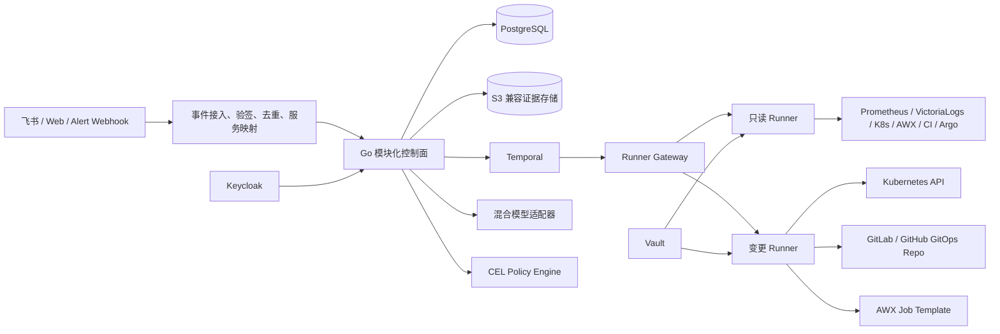

# AI Native Operations Intelligence & Safe Automation Platform

版本：2026 V3  
更新日期：2026-07-10  
状态：当前权威架构蓝图
替代关系：历史输入已归档至 [`docs/archive/`](../archive/README.md)，本文件作为后续实现依据。

---

## 1. 产品定位

本系统是既有监控、日志、Kubernetes、虚机、CI/CD、GitOps 和身份系统之上的“运维调查与受控执行治理层”，不替代这些事实源。

> 面向使用飞书、Kubernetes、Prometheus、VictoriaLogs 和传统虚机的内部研发团队，自动收集可核验证据、生成可纠正的故障假设，并在确定性策略和人工审批后执行少量白名单动作。

### 1.1 首版目标

- 单企业、单地域、多 Workspace 自托管。
- 只读调查覆盖 100 个服务、10 个 Kubernetes 集群、500 台 Linux/Windows 虚机。
- 接入 Alertmanager、夜莺、Prometheus、VictoriaLogs、Kubernetes、AWX、Argo CD、GitLab CI、Jenkins、GitHub Actions。
- 生产写操作只对 5 个白名单服务灰度开放。
- 以 Time to First Useful Evidence、调查有用率和安全执行率作为核心指标，不在没有基线时承诺降低 MTTR。

### 1.2 用户角色

| 角色 | 主要职责 |
| --- | --- |
| Platform Admin | 集成、Workspace、环境和平台配置 |
| SRE Operator | 调查事件、提出动作、执行值班流程 |
| Service Owner | 确认根因、复核本服务变更 |
| Approver | 按资源范围审批生产动作 |
| Auditor | 查看和导出不可变审计记录 |
| Viewer | 只读查看事件和调查 |

### 1.3 明确非目标

- 不建设第二套 CMDB 或“数字孪生”。
- 不建设组件安装、升级和兼容矩阵平台。
- 不建设多 Agent Mesh、自治 Agent 市场或通用 MCP 执行平台。
- 不引入任意 Shell、SSH、kubectl 参数或模型生成 YAML。
- 不执行虚机重启、数据库写入、DNS、网络、密钥或云资源销毁。
- 不直接操纵 GitLab CI、Jenkins 或 GitHub Actions 执行生产变更。
- 不为非 GitOps 应用自动执行版本回滚。

---

## 2. 不可变设计原则

1. 模型只生成观察、假设和动作提案，不属于可信计算基。
2. 权限、风险、审批和执行由确定性代码与 CEL 策略裁决。
3. 日志、Git、Runbook、告警和外部工具元数据都是不可信数据，而不是指令。
4. PostgreSQL 是领域事实源；Temporal 只拥有编排历史。
5. 控制面不保存或转发长期生产凭据。
6. 只读 Runner 与变更 Runner 使用不同身份、队列、节点和网络策略。
7. 任何生产审批必须绑定不可变计划摘要、精确目标和观测版本。
8. 状态不确定时先对账，禁止盲目重试副作用。
9. 每个结论必须引用证据；证据不足时必须降级或拒答。
10. 真实只读数据接入先于模型能力，安全链先于生产写入。

---

## 3. 总体架构



### 3.1 部署单元

| 单元 | 职责 |
| --- | --- |
| `control-plane` | REST API、OIDC、领域服务、Webhook、Web/飞书后端 |
| `workflow-worker` | Investigation、Approval、Execution Temporal Workflow/Activity |
| `environment-runner` | 出站领取类型化任务；按模式启动为 read 或 write |
| `web` | 事件、调查、证据、反馈、计划、审批、执行、审计页面 |

首版使用 Go 模块化单体，不把 Incident、Agent、Approval、Audit 拆成微服务。当前开发工具链固定为 Go 1.26.5。

### 3.2 数据所有权

- PostgreSQL：Tenant、Workspace、Environment、Service、Signal、Incident、Investigation、Evidence、Hypothesis、Feedback、ActionPlan、Approval、Execution、PolicyDecision、ToolInvocation、AuditRecord、ModelCall、Outbox。
- Temporal：重试、Timer、等待审批、Activity 调度和恢复。History 只保存 ID 和小型脱敏结果。
- S3 兼容对象存储：脱敏后的大型证据、报告和审计导出；PostgreSQL保存引用与 SHA-256。
- 外部系统：Prometheus、VictoriaLogs、Kubernetes、AWX、Git/CI/Argo 仍是各自事实源。

### 3.3 一致性

API 先在同一 PostgreSQL 事务中写入领域对象和 Outbox，再由 Dispatcher 启动/Signal Temporal Workflow。Activity 通过幂等键持久化结果；Web 只查询 PostgreSQL 投影，不直接读取 Temporal。

---

## 4. 调查领域与数据流

```text
SignalEnvelope
→ 验签与幂等
→ 指纹去重/告警风暴归并
→ Service/Environment 映射
→ Incident
→ Investigation
→ 有界并行查询
→ Evidence
→ Hypothesis
→ Feedback/人工确认
→ 可选 ActionPlan
```

### 4.1 服务映射

`ServiceBinding` 将逻辑服务按环境映射到：

- Kubernetes cluster/namespace/workload UID 和标签。
- Prometheus label selector。
- VictoriaLogs stream selector。
- AWX inventory/group/host。
- Git 仓库、CI pipeline 和 Argo Application。
- Owner、审批组和 Runbook。

解析状态为 `EXACT`、`AMBIGUOUS` 或 `UNRESOLVED`。后两者可以调查，但不得生成可执行计划。

### 4.2 核心状态

- Incident：`OPEN / INVESTIGATING / MITIGATING / RESOLVED / CLOSED`。
- Investigation：`QUEUED / RUNNING / PARTIAL / COMPLETED / FAILED / CANCELLED`。
- Hypothesis：`PROPOSED / CONFIRMED / REJECTED`。
- Approval：`PENDING / APPROVED / REJECTED / EXPIRED / REVOKED`。
- Execution：`QUEUED / LEASED / RUNNING / WAITING_EXTERNAL_APPROVAL / WAITING_SYNC / VERIFYING / SUCCEEDED / FAILED / ROLLED_BACK / CANCELLED`。两个 `WAITING_*` 状态只用于GitOps外部控制点，不持有Runner租约或生产凭据。

不存在由模型直接填写的最终 `root_cause`。只有人工显式确认的 Hypothesis 才能成为 Incident 的 `confirmed_hypothesis_id`。

### 4.3 证据契约

Evidence 必须包含来源连接器、查询摘要、时间窗、采集时间、服务/资源引用、脱敏状态、内容哈希、可信度、截断信息和原始对象引用。外部正文永远标记为 untrusted。

---

## 5. API 与 Runner 协议

公共 API 统一使用 `/api/v1`：

```text
POST /api/v1/integrations/{id}/webhooks/{provider}
GET  /api/v1/workspaces/{id}/incidents
POST /api/v1/workspaces/{id}/incidents/{incidentId}/investigations
GET  /api/v1/workspaces/{id}/investigations/{investigationId}
GET  /api/v1/workspaces/{id}/investigations/{investigationId}/evidence
GET  /api/v1/workspaces/{id}/investigations/{investigationId}/hypotheses
POST /api/v1/workspaces/{id}/investigations/{investigationId}/feedback
POST /api/v1/workspaces/{id}/action-plans
POST /api/v1/workspaces/{id}/action-plans/{planId}/execution-requests
POST /api/v1/workspaces/{id}/approvals/{approvalId}/decisions
GET  /api/v1/workspaces/{id}/executions/{executionId}
POST /api/v1/workspaces/{id}/executions/{executionId}:cancel
GET  /api/v1/workspaces/{id}/audit-events
GET  /api/v1/workspaces/{id}/services
PUT  /api/v1/workspaces/{id}/services/{serviceId}/environments/{environmentId}/binding
POST /api/v1/chatops/feishu/events
POST /api/v1/chatops/feishu/actions
```

Runner 只允许出站 HTTPS+mTLS：

```text
POST /runner/v1/jobs:lease
POST /runner/v1/jobs/{id}:heartbeat
POST /runner/v1/jobs/{id}:complete
```

除外部 Webhook 外，所有写请求要求 `Idempotency-Key`；同键不同请求哈希返回 409。Webhook 使用 `(integration_id, provider_event_id)` 唯一键和 payload hash，同一事件 ID 携带不同载荷时记录安全冲突并拒绝。PATCH要求 `If-Match`。列表使用不透明游标，默认50、最大100。错误使用 RFC 9457 `application/problem+json`。

`Integration` 是 Workspace/Provider/启停状态与 Vault `secret_ref` 的权威绑定。Webhook 的 Workspace 声明不是信任来源；控制面必须同时验证按 `integration_id/provider` 隔离的签名密钥和数据库作用域绑定。一个 Integration 的密钥不得用于签署另一个 Integration 的事件。

---

## 6. 模型与调查编排

### 6.1 混合模型策略

- `PUBLIC/INTERNAL` 数据脱敏后可以路由到云模型。
- `CONFIDENTIAL/RESTRICTED` 数据只能进入私有 OpenAI-compatible 端点。
- 模型调用记录 provider、model、prompt/schema 版本、token、耗时、成本和结果哈希，默认不记录正文。
- 主模型失败时允许一次受预算约束的 fallback；全部失败时输出确定性证据报告。

### 6.2 输出结构

模型只输出 JSON Schema 校验后的：

- observations：已有证据直接支持的事实。
- hypotheses：候选原因及支持/反驳证据引用。
- unknowns：缺失数据和不确定性。
- recommended_checks：下一步只读检查。
- proposed_actions：类型化动作提案，不含凭据或任意命令。

### 6.3 查询预算

单次调查最多12个工具调用；同一数据源并发不超过3；所有查询必须有时间窗、超时、返回量和字段限制。部分数据源失败时生成 `PARTIAL`，不得虚构缺失事实。

---

## 7. 受控执行安全链

唯一执行契约为规范化、签名的 `ActionEnvelope`：

```text
schema_version, action_id, workspace_id, incident_id,
action_type, target_ref, parameters, observed_state,
preconditions, evidence_refs, expected_outcome,
verification, compensation, risk, policy_version,
plan_hash, credential_scope, idempotency_key,
not_before, expires_at, trace_id,
signature{alg,key_id,value}
```

`plan_hash` 覆盖动作、精确目标、参数、观测版本、前置条件、验证、补偿、策略版本和有效期。任何字段变化均创建新计划并使旧审批失效。Envelope 使用 JCS 规范化 JSON，控制面以 Vault 中的 Ed25519 密钥签名；`signature` 不参与被签名载荷。Runner 使用固定信任根分发的公钥集验签，并检查 `key_id`、有效期和吊销列表。轮换期间只允许明确的当前/前一密钥，已吊销密钥立即失效。

### 7.1 确定性裁决

- CEL 在计划提交、凭据签发和实际执行前三次重评。
- 检查用户/工作负载身份、Workspace、环境、服务所有权、白名单、维护窗、冻结、并发、爆炸半径和参数边界。
- CRITICAL 动作首版直接拒绝。
- 审批人与申请人分离；审批默认30分钟过期。
- Vault 签发单任务、单目标、最长15分钟凭据；凭据只进入 Runner 内存/tmpfs。
- 试点期生产动作全局并发为1，并使用带 fencing token 的目标租约锁。

### 7.2 动作边界

| 动作 | 允许范围 | 审批与验证 |
| --- | --- | --- |
| K8s滚动重启 | 白名单 Deployment；校验 UID/resourceVersion、PDB、容量和无进行中 rollout；禁止删除 Pod | 1名非申请人；验证 rollout、Ready 和 SLO 10分钟 |
| K8s扩缩容 | 无HPA的白名单 Deployment；在策略上下限内；校验PDB、Quota和节点容量 | 1名非申请人；验证副本与SLO 10分钟 |
| GitOps回滚 | 计划绑定 source base commit、revert head commit、diff/tree hash和目标路径；创建MR/PR后进入 `WAITING_EXTERNAL_APPROVAL`。MR head或diff变化立即使平台审批失效。平台不绕过分支保护且不自行合并；合并后验证结果commit包含获批tree，再进入 `WAITING_SYNC` 并观察Argo auto-sync到该commit | SRE+Service Owner双人审批；仅在获批内容对应的commit为 Synced/Healthy 且SLO稳定15分钟后成功；超时转人工，不直接覆盖Argo参数 |
| AWX服务重启 | 固定Job Template；Linux systemd或Windows Service；逐台摘流、重启、验证、回流 | 1名非申请人；绝不重启虚机；失败保持摘流并人工接管 |

状态不确定时只允许查询原任务和对账，禁止再次发起写操作。全局、环境、连接器和动作类型均有 Kill Switch。

---

## 8. 连接器范围

### 8.1 首版真实适配器

- Alertmanager、夜莺：Webhook验签、事件ID幂等、统一 SignalEnvelope。
- Prometheus：instant/range query；时间与样本预算。
- VictoriaLogs：LogsQL query/hits/stats；强制时间窗、字段和limit。
- Kubernetes：只读资源与Event；写操作仅通过变更Runner类型化执行器。
- AWX：inventory/job status；写操作只允许配置的Linux/Windows服务重启模板。
- GitLab CI、Jenkins、GitHub Actions：只读提交、流水线、部署时间线。
- Argo CD：Application revision、sync、health和history。
- Feishu：事件回调、进度卡片、调查结果、反馈和Web审批深链。

所有适配器实现窄接口 `QueryProvider`、`ActionExecutor` 或 `HealthChecker`，不要求查询适配器实现升级/回滚生命周期。

---

## 9. 部署、可用性与数据治理

- 企业 Kubernetes 管理集群自托管。
- control-plane 与 workflow-worker 至少三副本。
- 每个信任区分别部署 read/write Runner；无公网入站。
- PostgreSQL、Temporal、Keycloak、Vault 使用企业高可用能力，平台只集成、不负责其生命周期。
- 目标可用性99.9%，RPO不超过5分钟，RTO不超过30分钟。
- 原始脱敏证据保留30天，结构化调查保留90天，审批和审计保留365天。
- AuditRecord只追加；每日生成包含记录ID、内容哈希和前一日摘要的规范化清单，用Vault中的独立Ed25519审计密钥签名，并写入启用Object Lock/WORM的对象存储。提供离线验签和恢复演练；开发环境若无Object Lock只能声明“可检测篡改”，不得声明不可变。

---

## 10. 16周路线图

| 周期 | 交付 | 出口 |
| --- | --- | --- |
| W1-2 | V3蓝图、仓库/CI、领域契约、迁移、Keycloak、Workspace/RBAC、Vault引用、服务目录 | 80%试点服务完成Owner和数据源映射；30个历史事故 |
| W3-4 | Alertmanager/夜莺、去重、Prometheus/VictoriaLogs、Incident/Evidence页面 | 10服务、2集群真实链路成功率≥95% |
| W5-6 | K8s只读Runner、AWX Linux/Windows上下文、三套CI/CD、Argo、飞书 | 支持5xx、OOM、CrashLoop、发布异常 |
| W7-8 | 混合模型、Hypothesis、引用、拒答、反馈、注入防护、≥100事故回放 | Top-3覆盖率≥70%，关键事实准确率≥95% |
| W9-10 | 100服务/10集群/500虚机、HA、预算、熔断、灾备和负载测试 | 全量只读覆盖；故障时正确PARTIAL |
| W11-12 | ActionPlan、CEL、审批、签名Envelope、Vault短凭据、Runner租约、四动作dry-run | 100个负向测试零绕过，审计100% |
| W13-14 | 四动作非生产执行、漂移/重复/吊销/网络/崩溃/Kill Switch演练 | 每类≥20次，零重复变更，验证≥95% |
| W15-16 | 3个K8s+2个虚机服务生产灰度，最多10台虚机，培训、Runbook、审计导出 | ≥30次受监督动作，无未授权动作或AI导致Sev1/Sev2 |

---

## 11. 测试与Go/No-Go

### 11.1 测试层次

- 单元：指纹、映射、规范化哈希、CEL边界、审批失效、游标、幂等、租约。
- 集成：PostgreSQL、Temporal test server、真实VictoriaLogs容器、K8s fake/kind、Vault dev、Keycloak test realm、HTTP契约服务器。
- E2E：告警→调查→证据→假设→反馈；计划→审批→Runner→验证→审计。
- 安全：跨Workspace、提示注入、计划篡改、伪造签名、凭据吊销、任意命令、旧租约。
- 故障：连接器超时、Temporal/Runner崩溃、重复投递、网络分区、执行结果不确定。
- 负载：1000告警/分钟持续10分钟，20并发调查。

### 11.2 指标门槛

- Webhook ACK p95 < 500ms，无事件丢失。
- Time to First Useful Evidence p95 < 60秒。
- 完整调查报告 p95 < 180秒。
- 服务映射完整率≥95%，真实调查成功率≥95%。
- Top-3假设覆盖率≥70%，证据引用完整率100%，关键事实准确率≥95%，无证据事实率≤1%。
- 值班人员有帮助评价≥80%，首个有用证据中位时间较人工基线下降≥30%。
- 未授权或重复生产变更为0，策略/审批/执行审计覆盖率100%。

任何安全指标未达标时，生产动作 Feature Flag 保持关闭。生产放量固定为历史回放→影子→非生产→5服务灰度→10%→30%→全量，各动作类型独立晋级。

---

## 12. 后续路线

只有内部试点达到门槛后才评估：更多日志后端、直接CI回滚、虚机应用版本回滚、相似事件向量检索、OPA适配器、跨地域Cell和多租户SaaS。新增能力不得削弱本蓝图的身份、审批、凭据、Runner隔离和审计边界。
