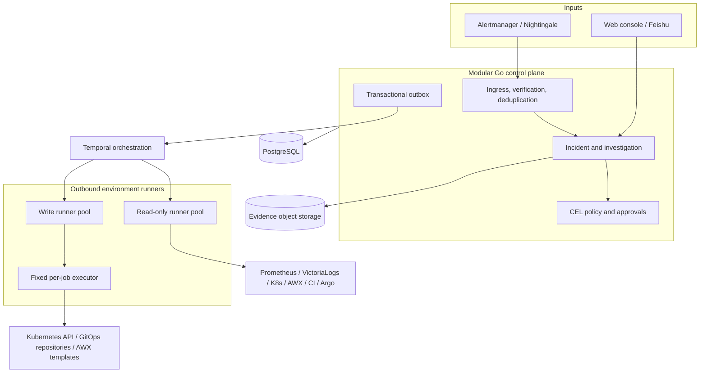
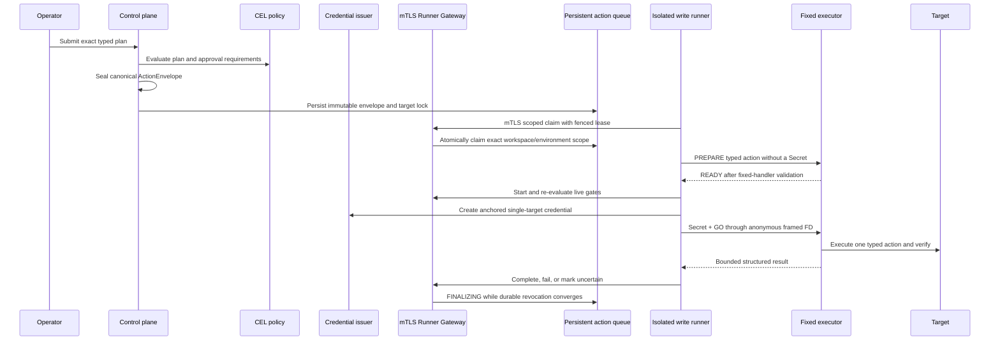

# Architecture Overview

AIOps System is an evidence-driven investigation and governed execution layer above existing observability and delivery systems. It does not replace Prometheus, log storage, Kubernetes, AWX, GitOps, CI/CD, or enterprise identity providers.

## System context



## Deployment units

- `control-plane`: HTTP APIs, identity and authorization, domain transactions, service catalog, signal ingestion, policy decisions, approvals, and audit access.
- `workflow-worker`: durable investigations, approval waits, execution orchestration, retries, and recovery. Workflow histories contain identifiers, never credentials or raw logs.
- `read-runner`: outbound-only, environment-scoped read activities. Its binary and image contain no mutation executor.
- `write-runner`: outbound-only write coordination. Its separate image can invoke only the fixed `/usr/local/libexec/aiops-executor`.
- `executor`: one fixed child process per job, with no payload-selected binary, argv, shell, or environment. It receives a Secret only after READY/GO authorization.

The codebase starts as a modular monolith. Module boundaries are explicit, but distributed services are introduced only when isolation, scaling, or ownership justifies the operational cost.

## Sources of truth

| Concern | Source of truth |
| --- | --- |
| Domain state, approvals, audit, execution state | PostgreSQL |
| Durable orchestration and timers | Temporal |
| Large redacted evidence bodies | S3-compatible object storage |
| Production desired application state | Git and Argo CD |
| Identity and session claims | Keycloak |
| Short-lived execution credentials | Vault or an equivalent dynamic issuer |

Temporal does not replace the domain database. Object storage does not become a queryable CMDB. Model output never becomes authoritative state without deterministic validation and, where required, human confirmation.

## Investigation path

```text
SignalEnvelope
  -> signature and idempotency checks
  -> alert fingerprinting and storm aggregation
  -> exact / ambiguous / unresolved service mapping
  -> incident and bounded investigation
  -> traceable evidence
  -> evidence-linked hypotheses
  -> human feedback or confirmation
  -> optional typed ActionPlan
```

Every query has a time range, timeout, result limit, field allowlist, and concurrency budget. A source failure produces an explicit `PARTIAL` result instead of an unsupported conclusion.

## Execution trust chain



The model can propose an action but cannot decide risk, permissions, approval, credential scope, or execution. Any drift in the plan, target revision, policy, approval, or environment invalidates the previous authorization. A post-GO ambiguity or unconfirmed process-group termination becomes `UNCERTAIN` and retains the target lock.

The current M4 implementation deliberately keeps Gateway action start closed and compiles no mutation adapters. `non-production` only performs the Linux isolation capability probe; no production write mode exists.

## Initial mutation boundary

Only four typed operations are in the pilot scope:

- rolling restart of an allowlisted Kubernetes Deployment;
- bounded scaling of a Deployment with no HPA, after PDB and quota checks;
- a revert PR/MR against a GitOps repository, respecting branch protection and Argo synchronization;
- Linux systemd or Windows Service restart through fixed AWX Job Templates.

Arbitrary shell, SSH, generated YAML, Pod deletion, VM reboot, database, DNS, network, secret, cloud resource, or direct CI mutation is out of scope.

## Availability and data safety targets

The target deployment is single-region HA: at least three replicas for stateless control-plane and worker units, with HA PostgreSQL, Temporal, Keycloak, and Vault. Design objectives are 99.9% monthly control-plane availability, RPO of at most five minutes, and RTO of at most thirty minutes.

These are target objectives, not claims about the current pre-alpha implementation. See the [roadmap](../roadmap.md) for the current release gates and the [detailed blueprint](implementation-blueprint-v3.md) for normative requirements.
