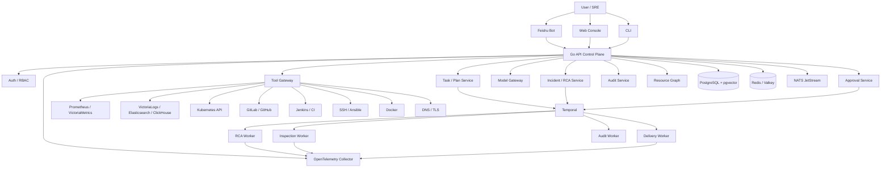

# AI Native SRE / AIOps Control Plane 最终实现蓝图

> [!WARNING]
> 本文已归档，仅用于追溯早期设计决策，不再代表当前实现契约。请使用[2026 V3 实施蓝图](../architecture/implementation-blueprint-v3.md)。

生成日期：2026-05-26

原始用途：作为本仓库早期实现的设计输入。本文吸收当时的研究材料，并结合“AI Native SRE / 平台工程 / AIOps / LLMOps”成长路线，形成早期内部试点构想。

---

## 1. 最终定位

本项目不是“运维聊天机器人”，也不是“大而全 CMDB”，而是：

> 面向 SRE / 云原生运维的 AI 原生运维控制平面。它把飞书 ChatOps、告警根因分析、K8s/Prometheus/日志查询、受控自动化执行、审批审计和知识沉淀整合成一个可落地的平台。

一句话表达：

> 用户在飞书或 Web 中发起运维问题，系统自动查询 Prometheus、日志、Kubernetes Event、发布记录和资源图，生成证据链、根因判断、处理建议，并在人工审批后执行受控修复动作。

这个定位比“我会 K8s / Prometheus / Jenkins”更有价值，因为它直接对应老板和团队关心的指标：

- 降低 MTTR
- 减少告警噪音
- 提升值班效率
- 规范变更审批
- 沉淀故障知识
- 提升研发交付效率
- 降低误操作和安全风险

---

## 2. 对当前设计文档的关键优化

当前目录里的设计已经很强，但存在几个需要收敛的点：

| 原设计问题                               | 最终优化                                                |
| ----------------------------------- | --------------------------------------------------- |
| Python/FastAPI 版和 Go 版并存，首版技术路线不够统一 | 最终采用 Go 作为控制面、Worker、执行器和 API 的主语言；Python 只能作为明确例外  |
| MVP 直接从“部署 Git 到主机”切入，价值强但风险和实现面偏大  | 先做“只读 RCA + 飞书 ChatOps + K8s 巡检”闭环，再做受控部署           |
| 更像通用 AI 运维平台，个人作品记忆点还不够锐利           | 明确主线为“飞书 AI 运维助手 + 告警根因分析 Agent + 受控自动化执行”          |
| 架构覆盖很全，但第一阶段容易过重                    | 分成 Core MVP、Controlled Action、Platform Expansion 三层 |
| Agent 设计偏宏观                         | 固化工具契约、证据链格式、风险分级和审批状态机                             |
| 前端页面较全，但首版重点不够突出                    | 首版 Web 只做任务、事件、审批、审计、资源、集成配置六类核心页面                  |

---

## 3. 最终技术路线裁决

### 3.1 主后端：Go 优先，且是默认唯一主线

首版采用 Go 实现控制面、API、Worker、Tool Gateway、执行器和 CLI。除非某个模块满足后文的 Python 例外条件，否则后端代码默认都用 Go。

理由：

- 更适合 SRE / 云原生工具链生态。
- 更适合长期运行的控制面、执行器和 Agent Tool Gateway。
- 更适合低资源、自托管和单二进制交付。
- 与 Kubernetes client-go、Temporal Go SDK、NATS、pgx、OpenTelemetry Go 生态匹配。
- 便于把项目包装成 AI Native SRE / 云原生平台工程作品，而不是普通 AI Web 应用。

推荐栈：

```text
Go 1.23+
net/http + chi
pgx/v5 + pgxpool
go-redis/v9 或 Valkey 兼容 Redis 协议
nats.go + JetStream
Temporal Go SDK
OpenTelemetry Go SDK
golang-migrate
testcontainers-go
```

Go 实现范围：

```text
API server
Temporal workflows and activities
Tool Gateway
Model Gateway
Risk / Policy / Approval / Audit services
Prometheus / Logs / Kubernetes / GitLab / Jenkins adapters
Feishu ChatOps
Resource discovery
Safe SSH / Ansible / Docker / K8s executors
CLI
Background workers
```

首版不创建 Python API 服务，不创建 Python Worker 主流程，不用 FastAPI 作为控制面。

### 3.2 前端

```text
React
TypeScript
Vite
TanStack Query
Tailwind CSS
lucide-react
```

界面风格按运维工作台处理：信息密度高、状态清楚、操作可追踪，避免营销型首页。

### 3.3 AI / 模型层

模型层独立为 Model Gateway，不绑定某一个 SDK。

支持：

```text
OpenAI-compatible API
LiteLLM
vLLM
Ollama
Azure OpenAI
Anthropic
Google
```

核心要求：

- Agent 只拿结构化工具结果，不直接碰生产凭据。
- 模型输出必须做 JSON Schema 校验。
- 工具调用必须经过 Tool Gateway。
- 模型调用要记录 token、耗时、模型名、prompt 版本和 fallback 信息。
- 高风险场景可以强制使用指定模型或本地模型。

### 3.4 Python 的角色：少用，只在优势明显时使用

Python 不做首版控制面主语言，也不参与 API、审批、审计、Tool Gateway、Temporal 主工作流和生产执行器。Python 只在满足以下条件时使用：

1. Go 实现成本明显更高。
2. Python 生态有决定性优势。
3. 该模块可以被隔离为离线任务、实验工具或可替换插件。
4. 不承载审批、审计、权限、生产执行的主链路。

允许的 Python 场景：

- 离线日志分析脚本
- 数据分析 notebook
- 特定 LLM/RAG 实验和评测脚本
- embedding 批处理
- 历史故障数据聚类
- 模型效果评估 Eval
- 报表或一次性数据迁移
- 后续独立 AI 分析 Worker，但必须通过 Go 控制面调度和审计

不允许的 Python 场景：

```text
主 API 服务
审批服务
审计服务
Tool Gateway
Risk / Policy Engine
生产 SSH / K8s / DB 执行器
Temporal 主 workflow
飞书回调主入口
资源事实源写入主链路
```

如果未来确实引入 Python 分析 Worker，它必须是可选组件：

```text
Go Control Plane -> NATS / Temporal Activity -> Python Analysis Worker -> structured result -> Go AuditService
```

也就是说，Python 可以做“分析能力插件”，不能做“控制平面核心”。

---

## 4. 总体架构



### 4.1 分层职责

| 层级      | 职责                                                                             |
| ------- | ------------------------------------------------------------------------------ |
| 接入层     | Web、飞书 Bot、CLI、REST API                                                        |
| 控制面     | 任务、计划、审批、审计、资源图、模型路由、工具注册                                                      |
| Agent 层 | SRE 主 Agent、RCA Agent、巡检 Agent、交付 Agent、安全 Agent                               |
| 工作流层    | Temporal 负责任务状态机、重试、暂停、恢复、补偿                                                   |
| 工具层     | PromQL、日志查询、K8s 查询、CI/CD 查询、SSH/Ansible、Docker、DNS                             |
| 数据层     | PostgreSQL 保存真相，pgvector 保存知识向量，Redis 保存短状态                                    |
| 事件层     | NATS JetStream 发布任务、告警、审计、Agent 事件                                             |
| 观测层     | OpenTelemetry、VictoriaMetrics、VictoriaLogs、VictoriaTraces/Tempo、Grafana        |
| 标准适配层   | CNCF / OpenTelemetry / Prometheus / CloudEvents / CDEvents / Gateway API 等标准协议 |
| 组件生命周期层 | 组件安装、升级、迁移、健康检查、回滚、兼容性矩阵                                                       |

核心原则：

1. Agent 负责分析和计划，不能直接执行危险动作。
2. Temporal 负责可靠执行，不能被普通队列替代。
3. Tool Gateway 是唯一工具入口。
4. 所有工具调用都要审计。
5. HIGH / CRITICAL 操作必须审批。
6. 先只读分析，再受控执行。
7. 先做一个能展示价值的小闭环，再扩展大平台。
8. 基础组件必须可插拔、可升级、可替换，业务代码不能绑定单一厂商实现。
9. 优先兼容 CNCF 与行业标准生态，再接入具体产品特性。

---

## 5. 标准化、可插拔与长期演进顶层设计

未来 3-5 年，这套系统真正的护城河不是固定使用某个数据库、日志库或模型，而是拥有一个“标准优先、适配器隔离、能力可发现、升级可治理”的 AI 原生运维平台底座。

基础组件会持续变化：

```text
VictoriaMetrics / Prometheus
VictoriaLogs / Elasticsearch / ClickHouse
VictoriaTraces / Tempo / Jaeger
Nginx / Envoy / Gateway API implementations
Redis / Valkey
PostgreSQL / pgvector / 外部向量数据库
ClickHouse
OpenTelemetry Collector
对象存储
模型服务与向量检索引擎
```

所以最终架构必须做到：

1. 业务服务面向标准协议和内部接口编程。
2. 具体基础组件通过 Adapter / Provider / ComponentProfile 接入。
3. 新版本和新特性通过 Capability 发现和 Feature Flag 启用。
4. 组件升级必须有兼容性矩阵、预检查、迁移、回滚和验证。
5. 开箱即用使用默认组件组合，但不阻碍替换成企业已有基础设施。

### 5.1 标准优先原则

优先适配这些标准和生态：

| 领域           | 优先标准 / 协议                                                        | 默认实现                       | 可替代实现                               |
| ------------ | ---------------------------------------------------------------- | -------------------------- | ----------------------------------- |
| Metrics      | Prometheus HTTP API、PromQL、Remote Write、OpenMetrics、OTel Metrics | VictoriaMetrics            | Prometheus、Thanos、Mimir             |
| Logs         | OTel Logs、结构化 JSON、日志查询适配器                                       | VictoriaLogs               | Elasticsearch、OpenSearch、ClickHouse |
| Traces       | OpenTelemetry Traces、W3C Trace Context                           | VictoriaTraces 或 Tempo     | Jaeger、Grafana Tempo、ClickHouse     |
| Events       | CloudEvents、CDEvents、NATS subjects                               | NATS JetStream             | Kafka、Pulsar、云事件总线                  |
| K8s          | Kubernetes API、CRD、Server-Side Apply、Gateway API                 | Kubernetes + Gateway API   | OpenShift、K3s、RKE2、托管 K8s           |
| Delivery     | GitOps、OCI Artifact、CDEvents、SLSA、Sigstore                       | Argo CD + Tekton           | Flux、GitHub Actions、GitLab CI       |
| Cost         | OpenCost                                                         | OpenCost                   | 云厂商账单 API                           |
| Feature Flag | OpenFeature                                                      | OpenFeature SDK / Provider | Unleash、flagd、LaunchDarkly          |
| Lineage      | OpenLineage                                                      | OpenLineage adapter        | DataHub、Marquez                     |
| Security     | OIDC、OAuth2、SPIFFE/SPIRE、OPA、SBOM/SPDX、SLSA                      | Keycloak、OPA、Vault         | 企业 IAM、安全网关                         |
| Model API    | OpenAI-compatible API、MCP、tool schema                            | Model Gateway              | LiteLLM、vLLM、Ollama、云模型             |

内部代码不能直接假设“日志一定是 VictoriaLogs”或“trace 一定是 Tempo”。正确方式是依赖抽象接口：

```text
MetricsQueryProvider
LogsQueryProvider
TraceQueryProvider
EventProvider
VectorStoreProvider
ObjectStoreProvider
GatewayProvider
ModelProvider
CostProvider
DeliveryProvider
```

### 5.2 组件画像 ComponentProfile

每个基础组件都必须在系统中有 ComponentProfile，用于描述版本、能力、兼容性和升级策略。

```text
ComponentProfile:
  name
  category: metrics|logs|traces|cache|database|vector|gateway|eventbus|workflow|model|security
  provider: victoria|postgres|redis|clickhouse|nginx|otel|custom
  version
  api_versions
  capabilities
  endpoints
  auth_ref
  health_check
  backup_policy
  upgrade_policy
  compatibility_matrix
  feature_flags
  status
```

示例：

```text
victorialogs:
  category: logs
  capabilities:
    - logs.search
    - logs.stream
    - logs.aggregate
    - logs.retention-policy

clickhouse:
  category: analytics
  capabilities:
    - sql.query
    - logs.long-term-analytics
    - trace-analytics
    - cost-analytics

postgres_pgvector:
  category: vector
  capabilities:
    - vector.search
    - hybrid.search
    - knowledge.store
```

### 5.3 Capability Registry

不要在代码里写死“某组件支持什么”。系统启动和集成测试时，组件适配器要注册能力。

```text
Capability:
  name
  version
  provider
  stability: alpha|beta|stable|deprecated
  input_schema
  output_schema
  required_permissions
  risk_level
```

Agent 和 Planner 只能基于 Capability 生成计划。这样当你从 VictoriaLogs 切到 ClickHouse，或者从 Tempo 切到 VictoriaTraces 时，RCA Agent 不需要重写，只需要换 provider。

### 5.4 Adapter Contract

所有基础软件都通过适配器接入。适配器必须实现统一生命周期：

```text
Discover()
HealthCheck()
GetCapabilities()
ValidateConfig()
PlanUpgrade()
Preflight()
Migrate()
Apply()
Rollback()
SmokeTest()
ExportEvidence()
```

查询类适配器还要实现领域接口：

```text
MetricsProvider.Query()
MetricsProvider.QueryRange()
LogsProvider.Search()
LogsProvider.Aggregate()
TraceProvider.FindTrace()
TraceProvider.GetServiceMap()
VectorProvider.Upsert()
VectorProvider.Search()
CostProvider.QueryAllocation()
```

### 5.5 组件升级治理

基础组件升级不能靠手工拍脑袋，必须进入平台工作流：

```text
1. 读取当前 ComponentProfile
2. 拉取目标版本元数据
3. 检查兼容性矩阵
4. 运行 preflight
5. 生成 upgrade plan
6. 生成备份和回滚计划
7. 创建审批
8. 执行升级
9. 运行 smoke test
10. 验证数据读写和告警链路
11. 更新 ComponentProfile
12. 写入审计证据包
```

每个组件必须有：

- Health check
- Version check
- Config validation
- Backup / snapshot policy
- Migration policy
- Rollback policy
- Smoke test
- Evidence export

### 5.6 开箱即用 Profile

提供三档部署 Profile，兼顾一人公司、中小企业和后续平台化。

| Profile  | 目标              | 默认组件                                                                                     |
| -------- | --------------- | ---------------------------------------------------------------------------------------- |
| compact  | 本地开发、个人作品、低资源试用 | PostgreSQL + pgvector、Redis/Valkey、NATS、Temporal、API、Worker、Web                          |
| standard | 中小团队生产试点        | compact + OTel Collector、VictoriaMetrics、VictoriaLogs、VictoriaTraces/Tempo、Grafana、MinIO |
| platform | 企业平台化           | standard + Keycloak、Vault、OPA、OpenCost、Argo CD、Tekton、Gateway API、NetBox、ClickHouse      |

组件选择原则：

- 默认组合必须开箱即用。
- 企业已有 Prometheus、ELK、ClickHouse、Redis、PostgreSQL 时，可以通过 Integration Profile 接入，不强制替换。
- 所有组件配置都要可导出为 Helm values、Kustomize overlay 或 docker compose env。

### 5.7 未来 3-5 年 AI 原生演进方向

这套系统要为以下趋势预留架构空间：

1. **从 Copilot 到 Autopilot**：先只读分析，再人审执行，最终对低风险动作自动闭环。
2. **从单 Agent 到 Agent Mesh**：SRE、DB、Security、Cost、Delivery、FinOps、LLMOps Agent 通过统一工具协议协作。
3. **从监控到语义可观测**：Metrics / Logs / Traces / Events / Deployments / Cost / Security Findings 统一成可推理事件图。
4. **从规则告警到事件智能体**：告警不再是单条消息，而是带上下文、证据、影响面和建议动作的 Incident Object。
5. **从静态 Runbook 到可执行 Runbook**：Runbook 变成带参数、风险等级、审批和回滚的工作流模板。
6. **从模型调用到模型治理**：模型选择、成本、效果评估、prompt 版本、tool schema 版本都要可审计。
7. **从资源列表到数字孪生**：资源图同时保存期望状态、观测状态、变更历史和故障关联。
8. **从单集群到多环境平台**：兼容多云、多 K8s、多机房和边缘节点。
9. **从人肉升级到组件生命周期管理**：基础软件升级由平台生成计划、预检、审批、执行、验证和回滚。
10. **从工具集成到标准生态**：优先接入 CNCF / OpenTelemetry / Prometheus / Gateway API / CloudEvents / OpenCost 等标准。

### 5.8 新章节对 MVP 的影响

首版不需要完整实现所有组件生命周期，但必须把接口边界留好：

- `internal/component`：ComponentProfile、CapabilityRegistry、UpgradePolicy。
- `internal/integration`：IntegrationProfile、ProviderConfig、HealthCheck。
- `internal/executor/*`：各类 provider adapter。
- `docs/compatibility-matrix.md`：记录默认组件版本和兼容策略。
- `deploy/profiles/compact`、`deploy/profiles/standard`、`deploy/profiles/platform`：三档部署配置。

Phase 1 只实现 ComponentProfile 的数据模型和默认注册，不做真实升级执行。Phase 3 后再实现 ComponentUpgradeWorkflow。

---

## 6. MVP 重新定义

最终 MVP 不建议一上来做完整部署平台，而是分成两个闭环。

### 6.1 MVP-A：只读智能运维闭环

目标：

> 飞书里 @运维助手，输入“分析 jop-gateway 最近 30 分钟 5xx 升高原因”，系统自动查询指标、日志、K8s Event、发布记录，输出证据链、可能根因和处理建议。

必须实现：

1. 飞书 Bot 接入。
2. Web Console 基础页面。
3. Task / Incident / Audit 数据模型。
4. Prometheus 查询工具。
5. 日志查询工具，首版可支持 VictoriaLogs 或 Elasticsearch 适配器。
6. Kubernetes 只读查询工具。
7. GitLab/Jenkins 发布记录查询工具，首版可 mock 或接 GitLab API。
8. RCA Workflow。
9. Model Gateway。
10. 证据链报告。
11. 审计事件。

输出示例：

```text
故障摘要：
jop-gateway 在 14:05-14:32 出现 5xx 升高，峰值错误率 8.7%。

影响范围：
prod / jop-gateway / namespace: jop / 3 个 Pod 均受影响。

关键证据：
1. Prometheus 显示 14:08 起 http_5xx_rate 明显升高。
2. Pod jop-gateway-7f9c 重启 2 次，原因 OOMKilled。
3. 日志中 14:09 后出现大量 upstream timeout。
4. GitLab 显示 13:58 有一次发布，commit: abc123。

可能根因：
最近发布引入更高内存占用，导致 Pod OOM 和请求超时。

建议操作：
1. 优先回滚到上一版本。
2. 临时扩容 memory limit。
3. 检查 commit abc123 中的连接池和缓存逻辑。

风险等级：
当前分析为只读，风险 LOW。回滚属于 HIGH，需要审批。
```

### 6.2 MVP-B：受控自动化执行闭环

目标：

> 在 RCA 之后，用户点击或在飞书确认“申请回滚”，系统生成计划、审批、执行、验证、审计。

必须实现：

1. Plan / PlanStep。
2. Risk Engine。
3. Approval Workflow。
4. Tool Gateway 拦截高风险动作。
5. Mock 回滚执行器。
6. 审批通过后继续 Temporal workflow。
7. 审批拒绝后终止。
8. 审计证据包导出。

首版执行动作可以先 mock，不直接操作生产。

### 6.3 MVP-C：Git 到主机部署

这个能力保留，但放到第二阶段。

原因：

- 部署链路涉及 Git、构建、镜像、主机、反向代理、域名、证书、健康检查和回滚，首版成本较高。
- 先把 RCA 和审批审计跑通，更容易展示 AI Native SRE 的价值。
- 部署能力后续可复用同一套 Task / Plan / Approval / Audit / Tool Gateway。

---

## 7. 核心产品功能

### 7.1 飞书 AI 运维助手

命令示例：

```text
@运维助手 分析 jop-gateway 最近 30 分钟 5xx 升高原因
@运维助手 查询 teach 服务 CPU 飙高原因
@运维助手 查询 prod 命名空间异常 Pod
@运维助手 生成今天的值班日报
@运维助手 查询最近一次 jop-gateway 发布记录
@运维助手 为这个告警生成故障复盘
@运维助手 申请回滚 jop-gateway 到上一版本
```

飞书交互流程：

1. 接收飞书事件。
2. 校验签名和租户。
3. 解析用户身份与权限。
4. 创建 Task 或 Incident。
5. 立即回复“已收到，正在分析”。
6. 异步启动 Temporal workflow。
7. 分阶段更新飞书卡片。
8. 如果需要审批，在卡片中展示 Approve / Reject。
9. 完成后推送结论和证据链。

### 7.2 告警根因分析 Agent

输入来源：

- Prometheus Alertmanager webhook
- Nightingale webhook
- 飞书手动提问
- Web Console 创建事件

分析上下文：

- PromQL 指标
- 日志关键词
- K8s Pod / Event / Deployment / HPA
- 最近发布记录
- Git commit 信息
- Jenkins pipeline 状态
- 历史相似事件
- Runbook 知识库

输出结构：

```json
{
  "summary": "string",
  "impact": "string",
  "time_window": "string",
  "suspected_root_causes": [],
  "evidence": [],
  "recommended_actions": [],
  "risk_level": "low|medium|high|critical",
  "requires_approval": false
}
```

### 7.3 K8s 智能巡检

检查项：

- Node NotReady
- Node CPU / Memory / Disk 水位
- Pod CrashLoopBackOff
- Pod OOMKilled
- Pending Pod
- ImagePullBackOff
- Deployment 副本不一致
- HPA 频繁扩缩容
- PVC 使用率
- 证书过期
- Ingress 异常
- CoreDNS / kube-proxy / metrics-server 状态

输出：

- 风险列表
- 影响服务
- 证据
- 修复建议
- 是否需要审批
- 可执行 runbook

### 7.4 受控自动化执行

支持动作分层：

| 动作类型   | 示例              | 风险       | 是否审批     |
| ------ | --------------- | -------- | -------- |
| 只读查询   | 查询 Pod、指标、日志    | LOW      | 否        |
| 非生产轻变更 | 重启测试环境服务        | MEDIUM   | 可配置      |
| 生产变更   | 回滚、扩容、reload 配置 | HIGH     | 是        |
| 破坏性动作  | 删除资源、数据库恢复、密钥轮换 | CRITICAL | 是，预留双人审批 |

---

## 8. 数据模型

### 8.1 核心表

```text
organizations
users
roles
permissions
resources
resource_relations
integrations
secret_refs
component_profiles
component_versions
component_upgrade_plans
capabilities
capability_bindings
provider_configs
tasks
task_events
plans
plan_steps
approvals
tool_calls
workflow_runs
audit_events
alert_events
incidents
evidence_items
runbooks
knowledge_documents
knowledge_chunks
model_providers
model_configs
model_calls
agent_runs
agent_messages
```

### 8.2 ComponentProfile

基础组件必须被建模，便于后续升级、替换、健康检查和能力发现。

```text
id
org_id
name
category
provider
version
api_versions jsonb
capabilities jsonb
endpoints jsonb
auth_secret_ref
config_hash
status
health_status
last_health_check_at
upgrade_policy jsonb
backup_policy jsonb
compatibility_matrix jsonb
feature_flags jsonb
created_at
updated_at
```

### 8.3 Capability

```text
id
org_id
name
version
provider
component_profile_id
stability
input_schema jsonb
output_schema jsonb
required_permissions jsonb
risk_level
enabled
deprecated_at
created_at
updated_at
```

### 8.4 ComponentUpgradePlan

```text
id
org_id
component_profile_id
from_version
to_version
status
preflight_result jsonb
compatibility_result jsonb
backup_plan jsonb
migration_plan jsonb
rollback_plan jsonb
smoke_test_plan jsonb
approval_id
workflow_run_id
created_by
created_at
updated_at
completed_at
```

### 8.5 Resource

资源是统一资产模型，不替代 NetBox / K8s / 云厂商，而是建立运维分析需要的资源图。

字段建议：

```text
id
org_id
name
type
provider
environment
region
namespace
status
external_id
source
labels jsonb
attributes jsonb
observed_state jsonb
desired_state jsonb
last_seen_at
created_at
updated_at
```

资源类型：

```text
host
k8s_cluster
k8s_namespace
k8s_workload
k8s_pod
container
application
database
middleware
prometheus_target
log_index
ci_pipeline
git_repository
dns_record
certificate
cloud_vm
network_device
storage_device
```

### 8.6 Task

```text
id
org_id
created_by
source: web|feishu|alert_webhook|api
title
natural_language_input
intent jsonb
status
risk_level
incident_id nullable
plan_id nullable
workflow_run_id nullable
approval_required
created_at
updated_at
completed_at
```

状态：

```text
created
planning
waiting_approval
executing
succeeded
failed
cancelled
rejected
rolled_back
```

### 8.7 Incident

```text
id
org_id
title
service_name
environment
severity
status
time_window_start
time_window_end
summary
root_cause
impact
recommendation
confidence
created_from_alert_id
created_at
updated_at
closed_at
```

### 8.8 EvidenceItem

证据链要结构化，不能只是一段 AI 文本。

```text
id
org_id
task_id
incident_id
source_type: prometheus|logs|k8s|gitlab|jenkins|runbook|manual
source_name
query
result_summary
raw_ref
score
metadata jsonb
created_at
```

### 8.9 Plan / PlanStep

```text
plans:
  id
  org_id
  task_id
  summary
  risk_level
  status
  generated_by_agent
  generated_by_model
  diff jsonb
  rollback_strategy jsonb

plan_steps:
  id
  plan_id
  step_order
  agent_name
  tool_name
  action_type
  description
  input jsonb
  expected_output jsonb
  risk_level
  approval_required
  status
```

### 8.10 ToolCall

```text
id
org_id
task_id
incident_id nullable
plan_id nullable
plan_step_id nullable
agent_run_id nullable
tool_name
tool_version
input_hash
output_hash
input_redacted jsonb
output_redacted jsonb
risk_level
approval_id nullable
status
error
started_at
ended_at
```

### 8.11 AuditEvent

审计只追加，不覆盖。

```text
id
org_id
actor_type
actor_id
source_ip
request_id
trace_id
task_id nullable
incident_id nullable
plan_id nullable
tool_call_id nullable
action
target_type
target_id
risk_level
decision
reason
metadata jsonb
created_at
```

---

## 9. Tool Gateway 设计

### 9.1 工具调用统一流程

```text
Agent / Workflow
  -> ToolGateway
  -> ToolRegistry
  -> PolicyEngine
  -> RiskEngine
  -> ApprovalService if needed
  -> Executor
  -> ToolCall record
  -> AuditEvent
  -> NATS event
```

### 9.2 首版只读工具

```text
prometheus.query
prometheus.query_range
logs.search
logs.count_by_pattern
k8s.get_pods
k8s.get_events
k8s.get_deployment
k8s.get_hpa
k8s.get_node_status
gitlab.get_recent_deployments
gitlab.get_commit
jenkins.get_recent_builds
runbook.search
resource.lookup
audit.write_event
```

### 9.3 第二阶段执行工具

```text
k8s.rollout_restart
k8s.scale_workload
k8s.rollback_deployment
docker.deploy_container
docker.rollback_container
ssh.run_command_safe
ansible.run_playbook
proxy.generate_nginx_config
proxy.test_nginx_config
proxy.reload_nginx
dns.suggest_record
dns.modify_record
```

### 9.4 高风险工具

默认必须审批：

```text
k8s.rollback_deployment
k8s.scale_workload in prod
k8s.delete_workload
k8s.delete_namespace
docker.stop_container in prod
ssh.run_command_privileged
ansible.run_playbook with become=true
dns.modify_record
network.modify_firewall
db.execute_write_sql
db.restore
db.drop_database
secret.rotate
cloud.destroy_resource
```

### 9.5 工具定义结构

```go
type ToolDefinition struct {
    Name             string
    Version          string
    Description      string
    InputSchema       json.RawMessage
    OutputSchema      json.RawMessage
    DefaultRiskLevel  RiskLevel
    ApprovalRequired bool
    Executor          string
    ReadOnly          bool
}
```

---

## 10. Agent 设计

### 10.1 SRE Orchestrator Agent

职责：

- 理解用户意图。
- 判断是查询、分析、巡检、变更还是复盘。
- 选择 RCA / Inspection / Delivery / Security Agent。
- 汇总证据链。
- 生成 Plan。
- 判断风险等级。
- 给出最终报告。

### 10.2 RCA Agent

职责：

- 告警分析。
- 指标异常解释。
- 日志上下文检索。
- K8s Event 关联。
- 发布记录关联。
- 历史事件召回。
- 根因候选排序。

### 10.3 Inspection Agent

职责：

- K8s 巡检。
- 主机巡检。
- 数据库基础巡检。
- 中间件基础巡检。
- 生成日报、周报和值班报告。

### 10.4 Delivery Agent

职责：

- Git 仓库分析。
- 构建方案识别。
- Docker / K8s 发布计划。
- 回滚计划。
- DNS / TLS / 反向代理计划。

### 10.5 Security Agent

职责：

- 风险识别。
- 危险命令识别。
- 敏感信息脱敏。
- 审批策略解释。
- 审计证据检查。

---

## 11. 工作流设计

### 11.1 AlertRCAWorkflow

```text
1. validate_alert
2. normalize_service_context
3. resolve_resource_graph
4. query_metrics
5. query_logs
6. query_k8s_events
7. query_recent_deployments
8. retrieve_similar_incidents
9. generate_rca_report
10. persist_evidence
11. post_feishu_card
12. write_audit_events
```

失败策略：

- Prometheus 查询失败：继续查日志和 K8s，报告中标记指标缺失。
- 日志查询失败：不中断 RCA，标记证据不足。
- 模型失败：fallback 到模板化报告。
- 飞书推送失败：Web Console 仍可查看结果。

### 11.2 ChatOpsQueryWorkflow

```text
1. receive_feishu_message
2. identify_user_and_permissions
3. parse_intent
4. choose_workflow
5. execute_readonly_tools
6. generate_answer
7. update_feishu_message
8. persist_task_and_audit
```

### 11.3 K8sInspectionWorkflow

```text
1. load_cluster_config
2. list_nodes
3. list_abnormal_pods
4. list_workload_risks
5. inspect_events
6. inspect_pvc_usage
7. inspect_ingress_and_certificates
8. generate_inspection_report
9. post_report
10. write_audit
```

### 11.4 ApprovalWorkflow

```text
1. create_approval
2. notify_approvers
3. wait_signal_approve_or_reject
4. on_approve resume_parent_workflow
5. on_reject terminate_parent_workflow
6. on_timeout mark_expired
7. write_audit
```

### 11.5 ControlledRemediationWorkflow

```text
1. load_incident_and_plan
2. risk_assessment
3. approval_gate_if_needed
4. dry_run_action
5. execute_action
6. verify_effect
7. rollback_if_failed
8. summarize_result
9. export_evidence
```

### 11.6 DeployGitToHostWorkflow

放到第二阶段。

```text
1. validate_task
2. inspect_git_repo
3. detect_runtime
4. generate_deploy_plan
5. risk_assessment
6. approval_gate_if_needed
7. clone_repo
8. build_image_or_artifact
9. deploy_to_host
10. configure_proxy
11. suggest_or_apply_dns
12. register_logs_and_metrics
13. health_check
14. rollback_if_failed
15. write_evidence
```

### 11.7 ComponentUpgradeWorkflow

基础组件升级工作流。首版只实现 plan / preflight / evidence，后续再开放真实 apply。

```text
1. load_component_profile
2. resolve_target_version
3. check_compatibility_matrix
4. collect_current_config_and_health
5. run_preflight
6. generate_backup_plan
7. generate_migration_plan
8. generate_rollback_plan
9. generate_smoke_test_plan
10. risk_assessment
11. approval_gate_if_needed
12. apply_upgrade_if_enabled
13. run_smoke_test
14. update_component_profile
15. write_audit_evidence
```

首版限制：

- 默认 dry-run。
- 不直接升级真实组件。
- 输出升级计划、风险点、兼容性结论和回滚计划。
- 真实执行必须在后续阶段开启，并强制审批。

---

## 12. API 设计

### 12.1 Task API

```text
POST   /api/tasks
GET    /api/tasks
GET    /api/tasks/{id}
POST   /api/tasks/{id}/plan
POST   /api/tasks/{id}/execute
POST   /api/tasks/{id}/cancel
POST   /api/tasks/{id}/rollback
GET    /api/tasks/{id}/events
GET    /api/tasks/{id}/audit
```

### 12.2 Incident / RCA API

```text
POST   /api/incidents
GET    /api/incidents
GET    /api/incidents/{id}
POST   /api/incidents/{id}/analyze
POST   /api/incidents/{id}/recommend-remediation
GET    /api/incidents/{id}/evidence
GET    /api/incidents/{id}/report
```

### 12.3 Alert API

```text
POST   /api/alerts/webhook/prometheus
POST   /api/alerts/webhook/nightingale
GET    /api/alerts
GET    /api/alerts/{id}
```

### 12.4 Feishu API

```text
POST   /api/chatops/feishu/events
POST   /api/chatops/feishu/actions
GET    /api/chatops/conversations/{id}
```

### 12.5 Resource API

```text
GET    /api/resources
POST   /api/resources
GET    /api/resources/{id}
PATCH  /api/resources/{id}
POST   /api/resources/discover
GET    /api/resources/graph
```

### 12.6 Integration API

```text
GET    /api/integrations
POST   /api/integrations
GET    /api/integrations/{id}
PATCH  /api/integrations/{id}
POST   /api/integrations/{id}/test
```

### 12.7 Approval API

```text
GET    /api/approvals
GET    /api/approvals/{id}
POST   /api/approvals/{id}/approve
POST   /api/approvals/{id}/reject
```

### 12.8 Audit API

```text
GET    /api/audit/events
GET    /api/audit/events/{id}
GET    /api/audit/export?task_id=...
GET    /api/audit/export?incident_id=...
```

### 12.9 Model API

```text
GET    /api/models/providers
POST   /api/models/providers
GET    /api/models/configs
POST   /api/models/configs
POST   /api/models/test
PATCH  /api/models/default
```

### 12.10 Component API

```text
GET    /api/components
POST   /api/components
GET    /api/components/{id}
PATCH  /api/components/{id}
POST   /api/components/{id}/health-check
GET    /api/components/{id}/capabilities
POST   /api/components/{id}/upgrade-plan
GET    /api/components/{id}/upgrade-plans
GET    /api/capabilities
GET    /api/compatibility-matrix
```

---

## 13. 前端首版页面

首版 Web 不做花哨大屏，做实用运维工作台。

### 13.1 Dashboard

展示：

- 今日告警数
- 已分析事件数
- 待审批数
- 高风险操作数
- 平均分析耗时
- 最近 RCA 结果
- 最近审计事件

### 13.2 ChatOps / Tasks

功能：

- 输入自然语言任务。
- 查看结构化 intent。
- 查看执行进度。
- 查看工具调用和证据链。
- 跳转审批和审计。

### 13.3 Incidents

功能：

- 告警事件列表。
- RCA 报告。
- 证据链。
- 推荐动作。
- 一键生成复盘。

### 13.4 Resources

功能：

- 服务 / K8s / 主机 / 集成资源列表。
- 资源详情。
- 资源关系。
- 手动登记 Prometheus、日志系统、K8s 集群、GitLab、Jenkins。

### 13.5 Approvals

功能：

- 待审批操作。
- 风险说明。
- diff / dry-run。
- approve / reject。
- 审批历史。

### 13.6 Audit

功能：

- 审计事件列表。
- 按 task / incident / actor / risk 过滤。
- 导出证据包。

### 13.7 Settings

功能：

- 模型配置。
- 集成配置。
- 飞书配置。
- RBAC 配置。

---

## 14. 代码结构

最终推荐 Go monorepo：

```text
.
├── AGENTS.md
├── README.md
├── Makefile
├── docker-compose.yml
├── .env.example
├── .codex
│   ├── config.toml
│   └── agents
│       ├── architect.toml
│       ├── backend-go.toml
│       ├── workflow-temporal.toml
│       ├── frontend-ui.toml
│       ├── security-review.toml
│       └── qa.toml
├── cmd
│   ├── api
│   ├── worker-rca
│   ├── worker-inspection
│   ├── worker-delivery
│   └── cli
├── internal
│   ├── api
│   ├── app
│   ├── auth
│   ├── approval
│   ├── audit
│   ├── chatops
│   │   └── feishu
│   ├── component
│   │   ├── profile
│   │   ├── capability
│   │   ├── compatibility
│   │   └── upgrade
│   ├── event
│   ├── incident
│   ├── integration
│   ├── model
│   ├── planner
│   ├── policy
│   ├── resource
│   ├── risk
│   ├── store
│   ├── task
│   ├── tool
│   ├── workflow
│   └── executor
│       ├── prometheus
│       ├── logs
│       ├── kubernetes
│       ├── traces
│       ├── vector
│       ├── cost
│       ├── gateway
│       ├── gitlab
│       ├── jenkins
│       ├── ssh
│       ├── ansible
│       └── docker
├── pkg
│   ├── contracts
│   ├── errorsx
│   ├── httpx
│   ├── natsx
│   ├── otelx
│   ├── temporalx
│   └── testx
├── migrations
├── web
│   ├── package.json
│   └── src
├── deploy
│   ├── compose
│   ├── helm
│   ├── k8s
│   └── profiles
│       ├── compact
│       ├── standard
│       └── platform
├── labs
│   └── python
│       ├── README.md
│       ├── evals
│       ├── notebooks
│       └── offline-analysis
├── docs
│   ├── architecture.md
│   ├── api.md
│   ├── data-model.md
│   ├── compatibility-matrix.md
│   ├── component-lifecycle.md
│   ├── security.md
│   ├── workflows.md
│   ├── chatops-feishu.md
│   ├── rca-agent.md
│   └── runbooks
└── scripts
    ├── dev.ps1
    ├── test.ps1
    └── migrate.ps1
```

`labs/python` 只用于实验、离线分析和模型评估，不参与主服务启动路径。任何 Python 代码进入生产链路前，必须满足：

- 由 Go 控制面调度。
- 输入输出为结构化 JSON。
- 不直接访问生产凭据。
- 不直接执行生产变更。
- 调用过程写入 ToolCall 和 AuditEvent。
- 可以被 Go 实现或其他实现替换。

---

## 15. 本地开发环境

本地开发环境采用 profiles，避免一次启动所有组件，也便于后续升级到 Helm/Kubernetes。

`compact` profile，首版默认：

```text
postgres + pgvector
redis 或 valkey
nats with JetStream
temporal
temporal-ui
api
worker-rca
worker-inspection
web
```

`standard` profile，第二阶段加入：

```text
otel-collector
victoria-metrics
victoria-logs
victoria-traces 或 tempo
tempo
grafana
minio
```

`platform` profile，第三阶段加入：

```text
keycloak
vault
netbox
opencost
clickhouse
gateway-api-controller
argo-cd
tekton
```

本地 MVP 不强制一次启动全部组件，避免开发复杂度过高。

每个 profile 都必须提供：

- 组件清单
- 默认版本
- health check
- 端口说明
- 数据目录
- 升级注意事项
- 清理脚本

生产部署优先使用 Helm / Kustomize，docker compose 只作为本地开发和小规模试用路径。

---

## 16. 安全边界

### 16.1 RBAC

角色：

```text
owner
admin
sre
developer
auditor
viewer
```

权限：

```text
task:create
task:execute
incident:read
incident:analyze
resource:read
resource:write
approval:approve
audit:read
model:manage
integration:manage
secret:manage
```

### 16.2 风险等级

```text
LOW: 只读查询、健康检查、摘要生成
MEDIUM: 非生产轻变更、测试环境重启
HIGH: 生产回滚、生产扩缩容、reload 配置、DNS 修改
CRITICAL: 删除资源、数据库恢复、写 SQL、密钥轮换、网络策略破坏性变更
```

### 16.3 审批规则

```text
LOW: 不审批
MEDIUM: 可配置是否审批
HIGH: 必须审批
CRITICAL: 必须审批，预留双人审批
```

### 16.4 密钥规则

- 数据库不保存明文密钥。
- 只保存 secret reference。
- 日志和审计输出必须脱敏。
- 所有凭据读取必须写审计。
- 飞书、模型、K8s、GitLab、Jenkins token 均按 secret ref 管理。

---

## 17. 测试策略

### 17.1 单元测试

必须覆盖：

```text
RiskEngine
PolicyEngine
ToolRegistry
AuditService
ApprovalService
Intent parser
RCA evidence formatter
Feishu signature verifier
ModelGateway fallback
```

### 17.2 集成测试

必须覆盖：

```text
创建任务 -> 执行 RCA workflow -> 生成 evidence -> 写审计
Prometheus mock 查询
日志 mock 查询
K8s fake client 查询
高风险工具被拦截
审批通过后 workflow resume
审批拒绝后 workflow terminate
```

### 17.3 E2E 测试

使用 docker compose 启动核心服务：

```text
api
worker
postgres
redis
nats
temporal
web
```

验证：

```text
创建 RCA 任务
查询任务状态
查看证据链
查看审计事件
创建高风险修复计划
审批通过
执行 mock 修复
导出证据包
```

---

## 18. 开发路线图

### Phase 0：项目骨架

交付：

- Go monorepo
- API health check
- 配置加载
- PostgreSQL migration
- ComponentProfile / CapabilityRegistry 最小数据模型
- compact / standard / platform 部署 profile 目录
- compatibility matrix 文档骨架
- Temporal client
- NATS client
- Redis client
- OpenTelemetry request\_id / trace\_id
- Web 基础壳

验收：

```text
go test ./... 通过
docker compose up 可启动核心服务
GET /healthz 正常
```

### Phase 1：RCA 只读闭环

交付：

- Task / Incident / Evidence / Audit 模型
- Prometheus 工具
- Logs mock / adapter
- K8s fake client / adapter
- RCA Workflow
- Model Gateway mock + OpenAI-compatible adapter
- Web Incident 页面

验收：

```text
POST /api/incidents/{id}/analyze 可生成 RCA 报告
报告包含 summary、impact、evidence、root cause、recommendation
所有工具调用有 ToolCall 和 AuditEvent
```

### Phase 2：飞书 ChatOps

交付：

- 飞书事件回调
- 飞书消息解析
- 飞书卡片回复
- 用户映射和权限校验
- ChatOpsQueryWorkflow

验收：

```text
飞书 @运维助手 可触发 RCA
飞书卡片可展示分析进度和最终结论
```

### Phase 3：审批与受控修复

交付：

- Plan / PlanStep
- RiskEngine
- ApprovalWorkflow
- Mock remediation executor
- Approval Web 页面
- 审计证据包导出

验收：

```text
HIGH 风险操作无审批不得执行
审批通过后 workflow 继续
审批拒绝后 workflow 终止
GET /api/audit/export 返回完整证据包
```

### Phase 4：真实 K8s / Prometheus / 日志接入

交付：

- kubeconfig secret ref
- Prometheus integration
- VictoriaLogs / Elasticsearch adapter
- GitLab / Jenkins adapter
- K8s 巡检报告

验收：

```text
可对真实测试集群执行只读巡检
可查询真实 Prometheus 指标
可查询真实日志系统
```

### Phase 5：Git 到主机 / Docker 受控部署

交付：

- git inspect
- build detect
- docker build / run
- safe ssh executor
- nginx config generator
- health check
- rollback

验收：

```text
能把测试 Git 仓库部署到测试主机
生产类动作必须审批
失败能回滚或输出明确证据
```

### Phase 6：平台化扩展

交付：

- Argo CD
- Tekton
- cert-manager
- ExternalDNS
- Crossplane
- NetBox
- Vault
- Keycloak
- OPA

---

## 19. 第一轮 Codex 实现提示词

把下面这段作为第一轮实现输入：

```markdown
你是本仓库的首席实现 Agent。请根据 `FINAL-AIOPS-IMPLEMENTATION-BLUEPRINT.md` 从零实现 AI Native SRE / AIOps Control Plane 的 Phase 0 和 Phase 1。

目标：
实现一个 Go 优先的本地可运行 MVP，完成“创建 RCA 分析任务 -> 查询 mock/adapter 工具 -> 生成证据链 -> 调用 Model Gateway 生成报告 -> 写审计 -> Web 查看结果”的闭环。

技术约束：
- Go 1.23+
- net/http + chi
- pgx/v5 + pgxpool
- PostgreSQL + pgvector
- Redis/Valkey
- NATS JetStream
- Temporal Go SDK
- OpenTelemetry
- React + TypeScript + Vite + TanStack Query

语言边界：
- 后端、Worker、Workflow、执行器、Tool Gateway、Model Gateway、Feishu ChatOps 全部使用 Go。
- 首轮不要创建 Python API 服务、Python Worker 主流程或 FastAPI 项目。
- 如需 Python，只允许放在 `labs/python`，用于离线实验、评估脚本或 notebook，且不得接入主启动链路。

请先实现：
1. 仓库目录结构。
2. AGENTS.md、README.md、Makefile、docker-compose.yml、.env.example。
3. Go API 服务：
   - GET /healthz
   - POST /api/tasks
   - GET /api/tasks
   - GET /api/tasks/{id}
   - POST /api/incidents
   - GET /api/incidents
   - GET /api/incidents/{id}
   - POST /api/incidents/{id}/analyze
   - GET /api/incidents/{id}/evidence
   - GET /api/audit/events
4. 数据库 migration：
   - organizations
   - users
   - component_profiles
   - capabilities
   - provider_configs
   - tasks
   - incidents
   - evidence_items
   - tool_calls
   - audit_events
   - model_providers
   - model_configs
5. 核心服务：
   - TaskService
   - IncidentService
   - AuditService
   - ComponentRegistry
   - CapabilityRegistry
   - ToolRegistry
   - ModelGateway
   - RCAService
6. 工具：
   - prometheus.query mock
   - logs.search mock
   - k8s.get_pods mock
   - k8s.get_events mock
   - gitlab.get_recent_deployments mock
7. 组件与部署 profile：
   - deploy/profiles/compact
   - deploy/profiles/standard
   - deploy/profiles/platform
   - docs/compatibility-matrix.md
   - docs/component-lifecycle.md
   - 默认注册 PostgreSQL、Redis/Valkey、NATS、Temporal、OpenTelemetry、VictoriaMetrics、VictoriaLogs、VictoriaTraces/Tempo 的 ComponentProfile
8. Temporal:
   - AlertRCAWorkflow
   - RCA activities
9. Web:
   - Dashboard
   - Tasks
   - Incidents
   - Incident Detail
   - Audit
10. 测试：
   - Risk / ToolRegistry 基础测试
   - ComponentRegistry / CapabilityRegistry 基础测试
   - RCAService 测试
   - AuditService 测试
   - API httptest
   - Workflow happy path 测试

限制：
- 不要真实连接生产系统。
- 所有外部工具先提供 mock executor。
- 所有工具调用必须生成 ToolCall 和 AuditEvent。
- 模型调用必须可 mock。
- 不允许保存明文密钥。
- 代码必须可运行，测试必须通过。

完成后输出：
- 创建的文件列表。
- 本地启动方式。
- 测试命令。
- MVP demo curl 命令。
```

---

## 20. 第二轮 Codex 实现提示词

```markdown
在 Phase 1 基础上，实现飞书 ChatOps。

目标：
飞书群里 @运维助手，可以创建 RCA 分析任务，并收到进度和结果卡片。

请实现：
1. Feishu integration 配置模型。
2. 飞书事件回调：
   - POST /api/chatops/feishu/events
   - POST /api/chatops/feishu/actions
3. 签名校验。
4. 飞书用户到系统用户的映射。
5. 消息 intent 解析。
6. ChatOpsQueryWorkflow。
7. 飞书卡片消息渲染：
   - 分析中
   - 分析完成
   - 需要审批
   - 执行失败
8. 测试：
   - 签名校验
   - 消息解析
   - workflow happy path

限制：
- 飞书 token 只允许 secret ref。
- 不允许把 token 打印到日志。
- 如果飞书发送失败，任务仍要在 Web 可查看。
```

---

## 21. 第三轮 Codex 实现提示词

```markdown
请实现审批、计划和受控修复闭环。

目标：
RCA 报告给出“建议回滚/扩容/重启”等动作后，系统生成 Plan，HIGH 风险操作必须审批，审批通过后执行 mock remediation。

请实现：
1. 数据模型：
   - plans
   - plan_steps
   - approvals
   - workflow_runs
2. 服务：
   - PlannerService
   - RiskEngine
   - PolicyEngine
   - ApprovalService
3. API：
   - POST /api/tasks/{id}/plan
   - POST /api/tasks/{id}/execute
   - GET /api/approvals
   - POST /api/approvals/{id}/approve
   - POST /api/approvals/{id}/reject
   - GET /api/audit/export?task_id=...
4. Workflow：
   - ApprovalWorkflow
   - ControlledRemediationWorkflow
5. 工具：
   - k8s.rollback_deployment mock
   - k8s.scale_workload mock
   - docker.rollback_container mock
6. Web：
   - Plan 展示
   - Approval 页面
   - Audit export
7. 测试：
   - HIGH 风险无审批不得执行
   - 审批通过后继续执行
   - 审批拒绝后终止
   - 审计证据包完整
```

---

## 22. 第一阶段验收标准

Phase 0 到 Phase 3 完成后，必须满足：

1. `docker compose up` 可以启动 API、Worker、PostgreSQL、Redis、NATS、Temporal、Web。
2. `go test ./...` 通过。
3. API health check 正常。
4. 可以创建 Incident。
5. 可以执行 RCA 分析。
6. RCA 报告包含证据链，而不是只有 AI 总结。
7. 所有工具调用都有 ToolCall。
8. 所有关键动作都有 AuditEvent。
9. 可以生成高风险修复 Plan。
10. 高风险 Plan 会创建 Approval。
11. 审批通过后 mock remediation 执行。
12. 审批拒绝后 workflow 终止。
13. Web 可以查看 Incident、Evidence、Task、Approval、Audit。
14. 系统能注册默认 ComponentProfile 和 Capability。
15. 提供 `compact`、`standard`、`platform` 三档部署 profile 目录。
16. 提供 `docs/compatibility-matrix.md` 和 `docs/component-lifecycle.md`。
17. Component upgrade plan 支持 dry-run，能输出预检、风险、备份和回滚计划。
18. README 提供本地启动和 demo 命令。
19. 不存在明文 token、绕过审批或 Agent 直接执行 shell 的路径。

---

## 23. 简历和面试表达方式

项目做完后，可以这样表达：

> 我设计并实现了一套 AI Native SRE 运维控制平面，核心能力是将大模型 Agent 接入 Prometheus、日志系统、Kubernetes、GitLab/Jenkins 和飞书 ChatOps。系统可以对告警进行自动根因分析，生成证据链和处理建议，并通过 Temporal 工作流、审批机制和审计证据包实现受控自动化修复。项目重点解决告警定位慢、值班重复工作多、故障知识难沉淀和生产变更风险高的问题。

可量化指标模板：

```text
告警分析时间：从 20-30 分钟降到 3-5 分钟
一线排障重复查询：减少 50%+
故障报告生成：从人工整理 30 分钟降到自动生成 1 分钟
高风险操作：100% 经过审批与审计
常见问题 Runbook 命中率：逐步提升到 60%+
```

---

## 24. 最终原则

1. 先做 RCA 和 ChatOps，因为它最能体现 AI Native SRE 价值。
2. 再做受控执行，因为没有审批审计的自动化会变成风险。
3. 最后做完整平台，因为平台化必须建立在真实闭环上。
4. Go 是后端主语言和默认唯一实现路线；Python 是例外工具，只用于离线分析、评估和生态优势明显的可替换插件。
5. PostgreSQL 是事实源，Temporal 是执行真相层，NATS 是事件广播层。
6. Agent 不能直接操作生产，必须通过 Tool Gateway。
7. 所有结论必须有证据链。
8. 所有高风险动作必须可审批、可拒绝、可回滚、可审计。
9. 飞书不是附属功能，而是运维入口。
10. 基础组件必须通过 ComponentProfile、CapabilityRegistry 和 Adapter Contract 管理，不能写死在业务代码里。
11. 优先兼容 OpenTelemetry、Prometheus、Kubernetes、Gateway API、CloudEvents、CDEvents、OpenCost、OpenFeature、OpenLineage 等标准生态。
12. 组件升级必须支持预检、计划、审批、备份、迁移、验证、回滚和审计。
13. 这个项目的价值不是“用了 AI”，而是“用 AI 系统性降低 MTTR、减少重复劳动、提升生产变更安全性”。
