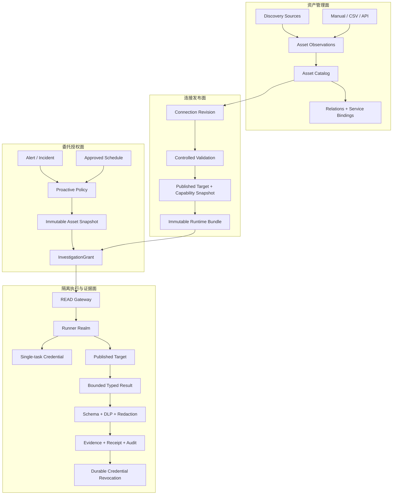

# 可运维资产、受控连接与受治理生产闭环设计规范

> 状态：书面规范已确认；已纳入完整生产闭环与小任务包增补
> 基线：`main@ad50d9f`
> 日期：2026-07-13
> 设计方法：Superpowers brainstorming + UI/UX Pro Max

## 1. 摘要

本设计把 AIOps System 从“围绕 Incident 的调查内核”扩展为“以可运维资产为基础、能够生产落地的受治理运维控制平面”。系统先建立带来源的资产目录，再把候选连接配置验证并发布为不可变运行能力，通过短期、限额、可撤销的 `InvestigationGrant` 授权隔离 Runner 主动排查；当可信 Evidence 支持处置建议时，再进入与 READ 完全隔离的不可变 ActionPlan、策略、重新认证、人工审批、短凭据、类型化执行、独立验证、对账/安全回滚、Receipt/Audit 生产闭环。

已确认的产品决策：

- 采用混合资产目录：支持手工、CSV/API、云平台、虚拟化平台、Kubernetes、AWX 与外部 CMDB 发现。
- 平台是运维事实索引和治理覆盖层，不替代外部 CMDB、云平台、Kubernetes 或 VictoriaMetrics Operator 的事实源地位。
- Agent 使用受控能力代理，不获得原始密码、SSH Key、通用终端、任意命令或任意 SQL。
- 主动调查由告警、事件或预批准定时策略触发；每次运行生成新的短期授权。
- 主动调查只执行已发布的类型化只读能力，并且最多生成 append-only `PROPOSAL_ONLY` ActionProposal；ActionProposal 本身没有执行权，Phase 4 也不存在 ActionPlan mutation。只有经认证的人另行发起、服务端重新派生并封存独立不可变 ActionPlan，且逐 Action 类型通过当前策略/门禁、最近 OIDC 认证、职责分离审批、一次性短凭据、类型化 WRITE Runner、独立验证和完整审计后，才可在生产 Canary 与发布门内执行。
- 前端采用已确认的企业运维控制台视觉：浅色高密度工作区、克制蓝色操作色、表格与主从详情，不使用聊天框、AI 头像、霓虹、发光或玻璃拟态。
- 前端应用平台固定为 React/TypeScript/Vite 与 TanStack Router/Query/Table；Go Control Plane 以同一 Origin 提供 API 和编译后的 SPA，并在同一生产镜像中携带 `web/dist`，生产环境不运行 Node、Vite 或独立 BFF。

## 2. 当前事实与设计动机

当前仓库具有以下基础：

- `services`、`service_bindings`、`integrations` 可以表达服务、环境和部分 Provider 绑定。
- `readconnector`、`readtarget`、`readruntime` 与 Runtime Bundle 已建立内容寻址、固定查询、固定 Target、网络策略、凭据引用和执行摘要边界。
- 正式 READ Runtime 目前只支持 Prometheus 与 VictoriaLogs。
- Kubernetes、AWX、Argo CD、GitLab、Jenkins、GitHub Actions 存在有界客户端，但尚未接入正式不可变 READ Runtime。
- `ActionEnvelope` 只支持 Kubernetes、GitOps 与 AWX 固定动作；生产写仍关闭。
- Runner 身份和作用域当前以 Tenant、Workspace、Environment 为粗粒度边界。
- Control Worker、正式 READ Runner、Outbox 与启动装配尚未形成完整在线产品链路，不能把现有安全模块等同于后端产品已经全部完成。
- 仓库尚无面向浏览器的完整 Control Plane API，也没有前端工程骨架；新阶段必须从契约和纵向切片开始同步建设前后端。

以上是 `main@ad50d9f` 的当前事实，不是本规划的最终产品边界。第 1–6 阶段继续保持生产写关闭；第 7 阶段建立逐类型受治理 Action 闭环并以独立 Canary 开门；第 8 阶段完成分批生产发布、持续 SLO/安全/DR 验收。任何阶段均不得把“已有安全模块”或“测试通过”误写成已经生产上线。

现有模型不能表达：

- 虚拟机或数据库作为稳定资产的身份、来源、生命周期、服务关系和最近观测。
- 同一资产的多个连接方式、连接版本、健康状态、信任材料和网络区域。
- 哪些已验证能力允许在哪个资产、Runner Realm 和数据等级下执行。
- Agent 主动调查所使用的资产快照、能力摘要、预算、凭据生命周期和 Kill Switch。
- VictoriaMetrics Metrics、Logs、Traces 与其采集、鉴权、告警和集群组件之间的区别。

不得继续把这些能力堆入 `integrations.config` 或 `service_bindings` 的无约束 JSONB。管理态数据可以变化，但任何运行中的调查必须固定到不可变版本。

## 3. 核心概念与不变量

### 3.1 五个不同概念

| 概念 | 责任 | 是否可变 | 是否包含秘密 |
|---|---|---:|---:|
| `Asset` | 记录可运维对象的身份、来源、归属和生命周期 | 是，带版本 | 否 |
| `ConnectionProfile` | 描述候选连接方式、信任、凭据引用、网络策略与能力 | 通过新修订变化 | 否 |
| `PublishedTarget` | 验证后编译出的内容寻址运行 Target | 否 | 否 |
| `Capability` | Provider 专属的类型化查询、Probe 或固定动作契约 | 版本化、发布后不可变 | 否 |
| `InvestigationGrant` | 一次调查对资产快照和能力摘要的短期委托授权 | 否，可撤销/过期 | 否 |

### 3.2 最高不变量

1. 模型不是授权 Principal，也不属于可信计算基。
2. 资产目录、浏览器、Task 和模型不能向 Runner 提交 endpoint、DSN、Secret、命令文本、SQL、任意 Header 或任意请求体。
3. `ConnectionProfile` 必须经过 Provider Schema 校验和隔离 Runner 验证，才能发布为内容寻址 Target/Capability Snapshot。
4. 运行中的 Investigation 固定使用 Asset Snapshot、Target、Capability、Runtime Bundle 和 Grant 摘要；后续配置发布不得改变其语义。
5. 只有 `ACTIVE + EXACT + PUBLISHED + AVAILABLE` 的资产能力可以进入实时调查。
6. `AMBIGUOUS`、`UNRESOLVED`、`STALE`、`QUARANTINED` 资产只能进入人工治理流程。
7. 所有凭据均按单资产、单 Capability、单 Task/Attempt 签发；TTL 不得超过 Grant 与 Lease，不可续期。
8. 结果不确定、目标漂移、授权失效、预算耗尽或 Kill Switch 关闭时必须停止并升级人工。

## 4. 四层架构



### 4.1 资产管理面

- 保存稳定身份、作用域、外部来源、外部 ID、Owner、关键度、数据等级、标签、版本和最近观测时间。
- 保存经过验证的关系，不构造未经来源证明的全局拓扑。
- 外部删除先转为 `STALE`，经过保留期和人工/来源确认后转为 `RETIRED`；不因一次同步缺失物理删除。
- 人工维护业务归属和服务映射；发现源不得静默覆盖人工锁定字段。
- 人工创建的资产只是“已登记的可运维引用”，不代表平台接管云资源、虚拟机、数据库或 Kubernetes 对象的期望状态与生命周期。

### 4.2 连接发布面

- Connection 修订主路径为 `DRAFT → VALIDATING → VALIDATED → PUBLISHED`；验证失败进入 `REJECTED`，已发布修订可进入 `SUPERSEDED` 或 `REVOKED`。
- 任何修改都创建新修订；不支持原地热修改。
- 发布编译出内容寻址 `TargetRef`、Capability digest 和 Runtime Bundle digest。
- 活动调查继续固定旧 Bundle；只有新建 Grant 可以引用新版本。

### 4.3 委托授权面

- 人类 OIDC Subject 或已发布 Scheduler Policy 是授权来源。
- 每次事件或定时运行都重新解析资产选择器、建立不可变资产快照并创建新 Grant。
- Grant 绑定资产、能力、预算、数据等级、策略版本、Kill Switch 版本、触发源和有效期。
- 模型只能作为运行归因 Actor，不能签发或扩大 Grant。

### 4.4 隔离执行与证据面

- 控制平面和浏览器不直接访问目标网络。
- Runner 按 Mode、Adapter Family 和 Network Zone 组成 `RunnerRealm`。
- Gateway 在 Claim、Start、Heartbeat、Complete 四个边界重新验证身份、Scope Revision、Grant、Asset Snapshot、Runtime 和 Kill Switch。
- 输出必须先通过 Provider Schema、大小/数量/时间预算、数据分类、DLP 与脱敏，才能成为 Evidence。
- READ Runner 只能产生 Evidence/ActionProposal，不能转化 Grant、凭据或 ActionPlan。受治理写入使用不同 Root、Realm、issuer、queue、Action Gate 和 WRITE Runner；模型永远不是 requester、approver 或 credential principal。
- WRITE 在 queue、claim、admission、credential issue、pre-mutation、verification 边界复验 Phase 6 handoff/READ baseline/current admission、Phase 7 Action platform successor、不可变 Plan、Policy、Approval、Realm、Credential 和 Kill Switch。执行器声明不是验证；结果不确定时停止、吊销、对账，仅执行预批准且可证明安全的补偿，否则升级人工。

## 5. 资产目录

### 5.1 首批资产类型

```text
SERVICE
LINUX_VM
WINDOWS_VM
BARE_METAL_HOST
KUBERNETES_CLUSTER
KUBERNETES_NAMESPACE
KUBERNETES_WORKLOAD
DATABASE_INSTANCE
DATABASE
METRICS_SOURCE
LOG_SOURCE
TRACE_SOURCE
AWX_INVENTORY
ARGO_APPLICATION
CI_PIPELINE
GIT_REPOSITORY
CLOUD_RESOURCE
```

Provider 细分通过严格类型详情表达，不把任意 Provider JSON 直接暴露为运行契约。

### 5.2 来源与合并规则

支持的来源类型：

```text
MANUAL
CSV_IMPORT
CONTROL_PLANE_API
EXTERNAL_CMDB
VSPHERE
PROXMOX
OPENSTACK
CLOUD_PROVIDER
KUBERNETES_OPERATOR
AWX_INVENTORY
```

来源枚举本身不等于已支持。除 `MANUAL` 外，每种来源都必须有独立生产 Adapter、真实验证、opaque `CredentialReference`、最小权限、增量 cursor/checkpoint、durable lease/fencing、限流/退避、字段 provenance、软删除/恢复和真实协议 E2E，并通过自己的 `AVAILABLE` gate 后才能创建权威 Observation。需要真实资格的 non-MANUAL Provider 即使验证成功，publication 也只能提交为 exact `PUBLISHED + UNAVAILABLE`；`MANUAL_V1` 是唯一可在 publication transaction 内直接进入 `AVAILABLE` 的特例。`CONTROL_PLANE_API` 使用有 Scope 的机器身份和幂等批次；`CSV_IMPORT` 使用签名批次、严格 schema 与隔离解析；CMDB、vSphere、Proxmox、OpenStack、Cloud、Kubernetes Operator 和 AWX 各自保持独立 Provider contract，不能退化为任意 endpoint/JSON 采集器。缺 Adapter、身份、验证或 gate 的类型必须明确 `UNAVAILABLE`，不得仅凭 SourceKind 接受数据。对由后继迁移拥有的 K8S/AWX，Phase 1 默认 hook 还会在 deferred commit 阻止稳定 Source 的初始创建；只有 owned successor 能在同一 serializable transaction 重载 revision/authority/typed-or-runtime facts 后开放该 SourceKind 的 creation branch。Phase 1 INSERT closure 仍强制该事务结束于 exact initial `UNAVAILABLE` + revision-1 `DRAFT` boundary，禁止 create+validate/publish/open 合并提交；后续阶段必须使用新的 serializable transaction。已有 Source 向 `UNAVAILABLE|SUSPENDED` 收敛不受 hook 阻塞。

Source 执行契约同样属于安全边界：每个 Source 最多一个 durable nonterminal Run；Validation 只绑定待验证 Revision 的空 checkpoint shape，不能读取、比较或推进已发布 Source checkpoint。普通 `DISCOVERY|CSV_IMPORT|API_INGESTION` claim 与 `RequestSync` 始终要求 exact `ACTIVE + PUBLISHED + AVAILABLE`。唯一的开门前例外是 `QUALIFICATION` Run：它只可由独立 mTLS workload 身份保护的固定生产资格入口结合 server-resolved opaque lab binding 创建和领取，要求 current `ACTIVE + PUBLISHED + UNAVAILABLE`、成功 validation、exact Profile/Revision/binding/runtime manifest，既不是普通 `RequestSync`，也不得出现在浏览器 `effective_actions`。它只执行固定 Provider read/protocol/DLP/credential-cleanup/HA 证明，封存 `QUALIFICATION_PROOF`，且数据库约束必须保证它不会调用 Catalog `PageCommitter`、创建 Observation/Asset/Relationship、推进 Source checkpoint/success pointers 或执行 missing/stale projection。

#### 5.2.1 Source Gate qualification 唯一持久 ABI

资格扩展只能使用以下列，禁止别名、兼容列或额外 evidence 列：

- `asset_sources` exactly 3 个 nullable columns：`gate_evidence_run_id uuid`、`gate_evidence_digest text`、`gate_evidence_expires_at timestamptz`。三列必须 all-null 或 all-present；需要 qualification 的 Profile 在 `gate_status IN ('AVAILABLE','DEGRADED')` 时必须 all-present，其余 gate 状态必须 all-null，关闭、证据漂移或过期必须在同一事务原子清空。这里的 `DEGRADED` 包含同一已批准 binding 的 checkpoint-lineage rollover 执行期，不能借 rollover 清空或替换 qualification pointer。`MANUAL_V1` 是唯一 publication transaction 可直接进入 `AVAILABLE` 的特例，始终不持有这三列。
- `asset_source_runs` exactly 23 个 nullable columns。13 个 qualification columns 为 `qualification_evidence_kind text`、`qualification_scope_digest text`、`qualification_binding_digest text`、`qualification_profile_descriptor_digest text`、`qualification_runtime_manifest_digest text`、`qualification_lab_binding_digest text`、`qualification_prior_receipts_digest text`、`qualification_result_digest text`、`qualification_receipt_issued_at timestamptz`、`qualification_receipt_expires_at timestamptz`、`qualification_signing_key_id text`、`qualification_signature text`、`qualification_receipt_digest text`；10 个 HA columns 为 `ha_owner_worker_identity_digest text`、`ha_takeover_worker_identity_digest text`、`ha_owner_process_instance_digest text`、`ha_takeover_process_instance_digest text`、`ha_takeover_receipt_digest text`、`ha_restart_receipt_digest text`、`ha_session_recovery_receipt_digest text`、`ha_cleanup_receipt_digest text`、`ha_response_loss_receipt_digest text`、`ha_fact_chain_digest text`。

所有 `*_digest` 值都只能是 lowercase 64-character SHA-256 hex；`qualification_signature` 只能是 canonical unpadded base64url，解码后重新编码必须逐字相等且不得含 `=`。`qualification_receipt_issued_at` 是 cleanup 后 receipt seal 的独立时刻，不能复制或复用 cleanup 前的 `work_result_recorded_at`；first-write seal 只能使用同一 `SERIALIZABLE READ WRITE` transaction 的唯一 `pg_catalog.transaction_timestamp()`，以 UTC fixed-six microseconds 入帧，SQL 必须逐值要求 caller issued time 与它相等且不早于 durable `ATTEMPT_CLEANED` receipt time。issued/expiry 都必须 finite，且 expiry 严格晚于 issued。最大 TTL 是 closed evidence-kind mapping：`TWO_WORKER_HA → 24 hours`、`PROVIDER_CANARY → 24 hours`，unknown kind 拒绝；seal 必须要求 `expires_at <= issued_at + interval '24 hours'`，不能信任 signer 自选未来 issued time 或更长窗口。只有已封存 terminal tuple 的 exact response-loss replay 可在后续 transaction 于 first-write time guard 前零写返回；changed replay拒绝。

Source pointer identity 只使用 named `asset_sources_gate_evidence_run_fk`：

```text
FOREIGN KEY (tenant_id, workspace_id, id, gate_evidence_run_id)
REFERENCES asset_source_runs (tenant_id, workspace_id, source_id, id)
DEFERRABLE INITIALLY DEFERRED
```

`gate_evidence_digest` 与 `gate_evidence_expires_at` 是被 deferred closure 逐值复验的 payload，不进入 identity FK。named constraint trigger `asset_sources_gate_evidence_closure_guard` 必须是 `DEFERRABLE INITIALLY DEFERRED`，在 commit 时重载 exact Tenant/Workspace/Source、published revision、canonical binding、terminal `PROVIDER_CANARY` Run、`cleanup_status=REVOKED`、qualification receipt、其 exact prior `TWO_WORKER_HA` receipt 与零 Catalog projection，并要求 Source pointer digest/expiry 分别等于 Run receipt digest/expiry。`source.gate_revision = run.gate_revision + 1` 只在 `AdmitGate` 首次写入 pointer 的开门 commit 精确成立；开门后的同 binding checkpoint-lineage rollover 可以让 Source epoch 高于该值，但 deferred closure 必须从这个 admission epoch 重载同 Source/Revision/binding 的完整、无间隙、逐 epoch terminal rollover receipt chain，当前 `DEGRADED` 只能对应链上已封存的进入边，后续 `AVAILABLE` 只能对应链上已封存的成功 terminal 边，不能把旧 qualification receipt 当作新 binding 的证明。partial tuple、cross-Scope/source、wrong kind、nonterminal、expired、oversize TTL、digest/canonical-signature-shape/expiry mismatch、错误 revision/binding、缺 HA、HA identity 不 distinct、非零 page/count/checkpoint/success projection、epoch 回退/跳跃或缺失 rollover receipt 均必须在 commit 失败。

qualification receipt 固定为 exactly 15-frame `FramedTupleV1`，帧 1–15 依次为 domain `asset-source-qualification-receipt.v1`、Tenant UUID、Workspace UUID、Source UUID、minimal-decimal revision、raw 32-byte canonical binding digest、raw 32-byte Profile descriptor digest、raw 32-byte runtime manifest digest、raw 32-byte lab-binding digest、evidence kind、raw 32-byte prior-receipts digest、raw 32-byte result digest、UTC `RFC3339` fixed-six-digit microsecond issued time、同格式 expiry、signing-key ID。`qualification_receipt_digest` 是该 tuple bytes 的 SHA-256 lowercase hex，signature 覆盖其 raw 32 bytes；scope digest 是独立的 exact composite-Scope guard，不替代前三个身份帧。receipt、API、Run、Audit、Outbox 和日志不得包含 endpoint、Credential Reference 的值、credential、raw Provider payload/cursor、Header/Body 或错误正文。

持久生命周期唯一为 `queue immutable binding → WorkResult → RecordCleanup(REVOKED) → receipt seal + terminal closure → Task 19A2b AdmitGate`：queue 时 evidence kind、scope/binding/profile/runtime/lab/prior digests 已固定且不可变；WorkResult 只追加 result digest，并由既有 Run trigger 从 durable `work_result_digest` 唯一派生 `qualification_result_digest`。既有 `RecordCleanup` 先在独立受控事务中持久 `REVOKED` 与 exact `ATTEMPT_CLEANED` receipt；在它完成前 issued/expiry/key/signature/receipt digest 与全部 HA columns 必须为 `NULL`。process-local `QualificationOutcome` 只携带 exact Run coordinates、evidence kind 与 sealed `LeaseFence`，不得降级为 caller-supplied epoch；它继承 fence 的 JSON/Text/Binary/log关闭边界且无 token/hash accessor。A2b application loader锁定 Run并以数据库时间调用 `LeaseFence.Matches` 后才铸造不可伪造的 opaque `SealAdmission`。A2b narrow sealer executor只消费该 admission与 A2c typed signer callback：它自己开启最终 serializable transaction、执行 `SELECT pg_catalog.transaction_timestamp()`、把同一 fixed-six DB time交给 callback构造 15-frame receipt/expiry/signature，再调用 seal primitive；callback不得取得 raw transaction、pool、DSN或 connector。SQL version/epoch CAS关闭 loader→seal TOCTOU，raw fence绝不跨入 capability connector/SQL。随后 primitive 从 durable facts 固定派生并原子写 receipt/HA、terminal Run、capacity/fence closure 与 exact `ASSET_SOURCE_RUN/TERMINAL_COMMITTED` Audit；Source pointer 仍全 `NULL` 且 gate 保持关闭。cleanup uncertainty/failure 继续走既有 Queue failure path，seal 必须拒绝；不确定重试若尚未封存则在新 transaction取得新 DB time并重签，若已封存则只允许 exact旧 tuple零写 replay。Task 19A2b `AdmitGate` 是唯一另一个 serializable transaction：它重载并复验 current receipts/evaluator 后，才原子写三列 pointer、`AVAILABLE`、`run.gate_revision+1`、Audit 和 Outbox。唯一 immutable verifier registry/outcome sink reloads durable facts，verifier 不能 claim、持久或自签；真实 metrics 只能经 production decorators 接线。普通 `RequestSync`、Queue claim/heartbeat 与 PageCommitter 仍需用数据库时间重载 current unexpired tuple，过期或漂移在任何 Catalog 写入前 effective fail closed。

`000015` 的正向 protected-column mutation authority 只能新增以下两条、且仅两条非重载 SQL primitive：

```text
public.asset_catalog_seal_qualification_receipt(
  uuid, uuid, uuid, uuid, bigint, bigint,
  text, timestamp with time zone, timestamp with time zone, text
) RETURNS boolean

public.asset_catalog_admit_source_gate(
  uuid, uuid, uuid, uuid, bigint, bigint
) RETURNS boolean
```

前者依次只接收 Tenant/Workspace/Source/Run、expected Run version/fence、signing-key ID、issued/expiry 与 signature；它不得接收 result、HA facts、receipt digest、status、cleanup、Audit payload 或任意 row/JSON/SQL。完成 exact session/isolation guard并锁 target Run 后，它先识别已封存 terminal tuple：全部 input逐值相等才零写 replay，任一变化拒绝。只有未封存 first-write branch 才继续要求 cleanup 已由 `RecordCleanup` 持久为 `REVOKED`、issued精确等于同一 transaction 的 `pg_catalog.transaction_timestamp()`且不早于 durable cleanup receipt time；然后从 durable WorkResult 与 append-only cleanup/HA receipts 派生 result/HA fact chain，重算 15-frame digest，按 locked evidence kind强制 `expiry <= issued + 24 hours`，并在 `PROVIDER_CANARY` 分支强制 expiry 不晚于 locked exact prior HA receipt expiry；随后原子写 issued/expiry/key/signature、派生 receipt digest、按 evidence kind 派生的 10 个 HA columns、fixed `SUCCEEDED/COMPLETED` terminal fields、server-derived terminal command digest/completion/version、capacity/fence closure与 fixed `ASSET_SOURCE_RUN/TERMINAL_COMMITTED` Audit。它不写 cleanup、Source pointer/status 或 Outbox。A2c signer callback必须消费 sealer executor给出的同一 DB issued time，并把 expiry取为 `min(issued_at + locked-kind maximum TTL, current signing-key not_after, opaque lab-binding expiry, exact prior-receipt expiry when present)`；任一必需上界缺失/已过期都拒绝，因此未来/回拨 issued time不能封存，canary/Source pointer也绝不能活得比其 prior HA receipt更久。后者依次只接收 Tenant/Workspace/Source/canary Run 与 expected Source version/gate revision；它不得接收 caller decision、status/reason、pointer digest/expiry、signature、HA facts或 Audit/Outbox payload，必须从 locked canary Run 派生 pointer/open Audit/Outbox并完成 exact idempotent open mutation。

两者均由 `aiops_schema_owner` 拥有，固定 `LANGUAGE plpgsql VOLATILE STRICT PARALLEL UNSAFE SECURITY DEFINER` 与 `search_path=pg_catalog, public, pg_temp`，强制 `SERIALIZABLE READ WRITE`。永久 ACL 不授予 PUBLIC、`aiops_control_plane_runtime` 或 `aiops_control_plane_workload` 任一执行权：独立 `LOGIN NOINHERIT`、无 membership 的 `aiops_source_gate_sealer` 只有 receipt-seal `EXECUTE`，`aiops_source_gate_admitter` 只有 gate-admit `EXECUTE`。exact-36 application database/schema ACL必须排除这两个 identity；只有 `000015` owned exact-38 与 application-schema global exact-110 postflight都通过后的 grant state才允许两者各持数据库 `CONNECT`、schema `USAGE` 与自己的单一 routine，除此之外无 relation/sequence/function 权限，且 routine 内分别逐字要求 exact `session_user`。两份短期凭据/DSN 必须不同于 migration/application 连接，分别只注入 Task 19A2c Worker outcome-sink 与 Control Plane gate-admitter 的 typed executor；不得进入通用 Repository pool、浏览器/OIDC router、模型、Task、Runner payload、endpoint/body、日志或另一 binary。缺 identity、交叉调用、共享 credential、ACL/membership 漂移或 ordinary application 直接调用均为 `42501`/closed admission。

Routine manifest 必须明确分层：`000015` 自有 manifest 在 A2a 后仍是 exact 38（existing 36 + new 2）；application schema 的 global routine ACL closure 则是内容寻址 exact 110，即 `000001..000014` 的 reviewed predecessor exact 72 加 Asset exact 38。权威静态复算得到 78 次 function definition、6 次同 identity replacement 与最终 72 个唯一 canonical identity，其中 68 个 trigger routine、4 个由 trigger/constraint 路径调用的 helper；基线没有 predecessor direct `EXECUTE` grant，normalization 后逐项只有 owner 与 PUBLIC `EXECUTE`。因此 predecessor 72 不是运行时任意快照，而是按 canonical signature、owner、grantor、grantability 进行 `C` 排序的固定 pre-up manifest；A2a up 在任何 DDL 前必须逐项验证其 identity/ACL，未知第 73 条、缺失、overload 或 owner/grantor/grantability/ACL 漂移都使整笔 migration 回滚并保持关闭，不得顺手修复未知对象。

Post-hardening predecessor direct allowlist 是 A2a 新增、固定且内容寻址的 exact 72 edges，不得称为“既有”或从运行时权限推导。每个 entry payload exactly 是 six-element JSON array，元素顺序固定为 `[grantee, canonical_signature, privilege_type, is_grantable, grantor, owner]`；合法代表 payload 逐字为 `["aiops_control_plane_runtime","public.reject_audit_mutation()","EXECUTE",false,"aiops_schema_owner","aiops_schema_owner"]`。`canonical_signature` 在 PostgreSQL 18.4、`quote_all_identifiers=off`、`search_path=pg_catalog,pg_temp` 下，以显式 schema/OID读取的 `namespace.nspname || '.' || proname || '(' || pg_get_function_identity_arguments(oid) || ')'` 产生；current exact72 不允许重复 signature。payload 编码固定为 UTF-8、无 BOM、无开头/结尾/元素间可选空白、无换行，boolean 只能是 JSON literal `false`；字符串编码器只把 U+0022 转为 `\"`、U+005C 转为 `\\`、U+0000..U+001F 转为 lowercase `\u00xx`，其余有效 Unicode scalar（包括 `/`）直接输出其 UTF-8，非法 UTF-8或 surrogate拒绝。SQL 与 Go 必须使用这一专用 canonical encoder；`jsonb::text`、通用 encoder 默认 escaping 或任何其它 JSON serialization 都不是合同。完整 C-order identity list 与唯一 production expected digest 只存在于 [Pack06 canonical predecessor exact72 runtime EXECUTE manifest](../plans/2026-07-13-governed-operations/01-assets/06-source-external-cmdb.md#canonical-predecessor-exact72-runtime-execute-manifest)；本规范不得复制平行清单。

Manifest domain 逐字固定为 `source-gate-predecessor-runtime-execute-manifest.v1`；entry 按 `canonical_signature COLLATE "C"` 排序，production frame exactly 是 `int4send(51) || domain UTF-8 bytes || int8send(72) || Σ(int4send(payload UTF-8 byte length) || payload bytes)`，SHA-256 作用域是这整个 byte string，输出 lowercase 64-character hex且不含 `sha256:`。独立 one-entry known vector只用于证明同一 encoder/framing，不替代 production exact72 digest：上述 `public.reject_audit_mutation()` payload 是 122 bytes，domain 是 51 bytes，row count 为1，完整189-byte frame hex逐字为 `00000033736f757263652d676174652d7072656465636573736f722d72756e74696d652d657865637574652d6d616e69666573742e763100000000000000010000007a5b2261696f70735f636f6e74726f6c5f706c616e655f72756e74696d65222c227075626c69632e72656a6563745f61756469745f6d75746174696f6e2829222c2245584543555445222c66616c73652c2261696f70735f736368656d615f6f776e6572222c2261696f70735f736368656d615f6f776e6572225d`，最终 SHA-256 必须为 `4c58b76019db0f92871b972c7dabbd677ac01d97ac85ae3bbb6fe9f3822d8cc3`；SQL 与 Go 必须独立复算同值。A2a migration、application admission 与 exact-12 test 必须逐项使用链接的Pack06清单并嵌入其production expected digest，不得从运行时catalog或migration文本生成清单/常量后自行接受；任一 row count、字段、顺序、payload byte或 digest 漂移都关闭。只有 pre-up exact72 匹配时，up 才可显式枚举撤销这72条 PUBLIC `EXECUTE`并授予runtime exact72 direct allowlist，同时继续对 existing36/new2精确revoke；禁止`ON ALL FUNCTIONS IN SCHEMA`。

up 后 global 110 全部无 PUBLIC `EXECUTE`，owner edge exact 110；非 owner direct edges 为 runtime exact 90（新增 predecessor 72 + 已审 Asset 18）、sealer exact 1 与 admitter exact 1，合计 exact 92 且全部 owner-grantor/non-grantable。workload direct exact 0、经 runtime effective exact 90；runtime effective exact 90；migrator不经显式 `SET ROLE` 时 direct/effective exact 0；capability effective/direct edge 仍只有 sealer→seal 与 admitter→admit。global admission 必须同时检查 identity、direct/effective edge、PUBLIC absence、owner、grantor、grantability 与 multiplicity。A2a down 先显式撤销 A2a 新增的 runtime→predecessor exact-72 edges，再删除 `000015` 自有 38并显式枚举恢复 predecessor 72 的 normalized PUBLIC `EXECUTE`，使 catalog/owner/ACL 与 pre-up predecessor manifest 精确相等；禁止 schema-wide grant/revoke，也不得恢复未知对象。up/down/up、partial/unknown、wrong predecessor ACL、unexpected 111th routine 与 dump/restore 都是 required evidence；application identity 的关键 DML、trigger 及四条 helper 调用路径必须在 hardening 后保持既有行为，并在 down/re-up 后复验。恢复与 admission 同时冻结 global exact 110、predecessor exact 72、新增 runtime exact-72 edge manifest及其撤销/恢复关系；未来 `000016..000022` 每次新增或替换 `public` routine 都必须更新内容寻址 global manifest、显式 PUBLIC revoke 与回滚合同。任何未知 routine，或未来 migration 新增 public routine 却未显式 revoke PUBLIC，都会关闭 admission。

两条 primitive 与 A2b gate close/reconciliation 的唯一 durable lock protocol沿用 Queue 的 Run-first顺序：先 exact target qualification/canary Run `FOR UPDATE`，再按 immutable receipt order、以 UUID C-order 打破并列锁 supporting prior qualification Runs `FOR UPDATE`，再 Source `FOR UPDATE`，最后 published Revision `FOR UPDATE`；immutable authority/Audit receipts只按 canonical order重载而不反向取锁，Audit/Outbox append永远最后。seal CAS 精确比较 target Run `version` 与 `fence_epoch`；admit CAS 精确比较 Source `version` 与 `gate_revision`，terminal Run/Revision 依赖已封存不可变性。仅关闭/expiry reconciliation 可在 expected Source version/gate revision 下只锁 Source→Revision并更新允许的关闭态字段，由 existing trigger 清 pointer；它不再等待 Run，因此不形成反向锁序。

runtime 不再持有 `asset_sources`/`asset_source_runs` relation-level `INSERT|UPDATE`。Source 使用列级 INSERT/UPDATE 且排除三列 pointer；Run 的列级 INSERT 只包含既有初始列与 exact 7 个 queue-binding columns，其他 16 个 receipt/HA columns 无 INSERT，列级 UPDATE 只包含既有 lifecycle columns且 23 个 qualification/HA columns 全部无 UPDATE。因此 Source 三列 direct INSERT/UPDATE、Run 23 列 direct UPDATE，以及 Run 除 7 个 queue-binding columns 外其余 16 列 direct INSERT 都必须返回 `42501`。关门、reference drift 与 expiry reconciliation 继续由既有受控状态 mutation 的 trigger 原子清 pointer，不新增第三条 primitive。

只有 exact `(source_kind, provider_kind, published profile_code)=('MANUAL','MANUAL_V1','MANUAL_V1')` 是不要求 qualification pointer 的特例；exact non-MANUAL 且 provider/profile 均非 `MANUAL_V1` 才是 qualification-required，缺 published row、混合 MANUAL 边界或任一不一致都产生 unknown 并按 `IS TRUE` fail closed。该判别直接内联于既有 deferred trigger，不新增 named SQL predicate；Task 19A2b 才拥有 qualification-only Repository/Queue predicate。

Task 19A2a 的 PostgreSQL closure 只证明数据库可重算的 structural facts：exact Scope/Revision/binding、lifecycle/zero projection、HA/canary 绑定、15-frame bytes/digest、canonical signature shape、first-write same-transaction DB issued time、cleanup-time ordering、issued/expiry 顺序、closed maximum TTL和 pointer payload equality。`000015` 不拥有 current public-key、installed Profile/runtime registry，因此 A2a 不得宣称密码学验签、current signing-key 或 runtime-manifest drift 已复验。Task 19A2c 的 sole signer/immutable verifier registry 产生真实 seal；Task 19A2b 先从普通只读事实 loader取得 immutable snapshot，然后在独立 admitter serializable transaction 内立即以同一 immutable registry/evaluator 重验 Profile/runtime/key/signature/expiry，再调用 admit primitive。该 primitive以 Source CAS、locked terminal canary 与 immutable Revision重做全部 durable structural closure；任一 snapshot/registry generation 或 CAS 漂移整笔回滚。专用 admitter credential 的持有者是显式可信执行边界，绝不能下放给普通 workload；A2a trigger不能冒充 current Go trust check。

只有 migration-owner 可在 disposable `_test.go` database 中，为 closure/recovery 测试构造 structurally-valid final `AVAILABLE` fixture；synthetic pointer 与 `AVAILABLE` 必须位于同一最终 serializable transaction。该 fixture 及其 canonical synthetic signature 只证明 structural shape，不能成为密码学验签、Task 19A2a/19A2b、G2/G4 或 availability 证据，也不能进入 production assembly。测试 fake、临时 bypass、普通同步成功或最终 Provider matrix 都不能替代真实 receipt 和 `AdmitGate`。

当前纠偏后的实现与合并顺序唯一为 `reachability docs corrective → manager exact-3 contract sync → source-gate capability-identity harness C0 → pre-A2a exact-2 routine/test-boundary corrective → manager exact-3 evidence sync → global routine ACL exact-11 contract + status sync → pre-A2a formal-fixture compatibility exact-9 corrective → pre-A2a identity-FK fixture compatibility exact-9B docs-only contract checkpoint → [DEVELOPMENT_PAUSED] → resumed fresh test-only identity-FK fixture corrective → fresh Task 19A2a exact-12 → post-A2a exact-2 validation corrective → Task 19A2b → Task 19A2c → Task 29A → Task 19B → Task 29B`；每步只消费最新 `main` 已合并契约，PR/fixture/旧 dirty worktree 或未合并实现不得反向成为事实源。global routine ACL exact11 已由 PR #152 合并到 `main@d8d632f453929fbe056dc499a6d64144d83011bf`，formal-fixture exact9 已由 PR #153 合并到 `main@c0b620e6fff9de0b746504f5fb7231fcb4a213c4`、tree `0af13374448f1386593291631e10a07add41440b`。capability-identity harness C0 只拥有 `.github/workflows/ci.yml`、`.env.example`、`scripts/with-local-postgres.sh`、`docs/operations/local-postgresql-development.md`、`internal/assetcatalog/postgres/migration_integration_test.go`、`internal/assetcatalog/postgres/recovery_container_test.go`、`internal/assetcatalog/postgres/migration_recovery_integration_test.go` 与 `internal/store/postgres/migrations_integration_test.go`，只预置隔离角色/DSN/证书、bidirectional future-gated application-DB ACL reconciliation和测试 identity，不授予函数或业务能力；只有 exact-38 owned manifest + exact-110 global ACL postflight进入 grant分支并随后通过 full admission，exact-36/down/unknown/partial都先 revoke并验 absent，unknown/partial再 fail closed。`.env.example` 同时预留空的 `AIOPS_SOURCE_GATE_ADMIT_DATABASE_URL` 与 `AIOPS_DISCOVERY_SOURCE_GATE_SEAL_DSN_FILE`，A2c 才装配。前两次 fresh A2a 分别因 predecessor72 默认 PUBLIC `EXECUTE` 的额外 capability edges及exact3/trigger/drop fixture冲突停止；PR #153 后的新 fresh A2a 又确认合法identity FK的两种表达都会被merged fixture拒绝。全部 partial A2a 都是 `STOPPED/NOT PASS`，停止的`cb00`及其他 dirty/stopped A2a worktree/WIP/snapshot 永不作为输入，任何未完成实现都不提交、不合并。

PR #153 已完成 pre-A2a formal-fixture compatibility exact9，只冻结 exact3 columns、closure trigger 与 down drop 的baseline/formal双完整状态、可逆分解和auxiliary matrix。截至2026-07-23用户决定暂停开发；本轮 pre-A2a identity-FK fixture compatibility exact9B 只把八份权威文档冻结为 docs-only 暂停检查点，原 Phase B test-only实现永久停止于本轮并保持`NOT_STARTED`，不是本检查点或其后文档PR的交付。冻结的未来 parser/extractor合同只可识别并可逆剥离两种合法表达：table-inline named constraint，或唯一精确top-level `ALTER TABLE public.asset_sources ADD CONSTRAINT asset_sources_gate_evidence_run_fk`；有效formal状态必须有且仅有named `asset_sources_gate_evidence_run_fk`，逐字等价于 `FOREIGN KEY (tenant_id, workspace_id, id, gate_evidence_run_id) REFERENCES asset_source_runs (tenant_id, workspace_id, source_id, id) DEFERRABLE INITIALLY DEFERRED`，source/reference column order、table/schema与mapping均精确，digest/expiry不得进入identity。baseline必须完全没有该FK；formal→baseline→formal必须可逆并在重建后重验同一manifest。

未来实现必须 fail closed拒绝 missing/partial/duplicate、wrong或quoted alias constraint name、错误source/reference columns/order/table/schema、6-column或digest/expiry identity、`NOT DEFERRABLE`、`INITIALLY IMMEDIATE`、动态DDL、除该唯一精确top-level创建语句外的任何ALTER、后续任何DROP/VALIDATE/rename/disable lifecycle、额外gate constraint或up/down mismatch；不得使用宽松contains、只删除first match、隐藏/转义标识符或跳过既有matrix。该test-only corrective不得收窄PR #153 exact3/trigger/drop auxiliary matrix、既有adversarial cases、global exact72/110、owned exact38、ACL/owner/grantor/grantability、C-order或down revoke/restore manifest；不修改migration、ABI、OpenAPI、production code、完成度或能力状态。恢复开发后的唯一入口是从届时最新`origin/main`创建fresh、独立test-only identity-FK fixture corrective，完成真实RED→GREEN、完整验证、独立复核、PR与合并后才允许fresh Task19A2a exact12；A2a仍禁止修改该pre-A2a helper。docs-only exact9B不等于corrective实现完成，所有 Source/Provider/Worker 继续 `NOT_STARTED/UNAVAILABLE/CLOSED`。

Gate epoch 采用闭合算术：起点 `G` 的首次发布路径为 Validation Run `G`、publication `UNAVAILABLE/G+1`、qualification Run 保持该 closed epoch、A2b open `AVAILABLE/G+2`；显式可见验证路径为 Source `VALIDATING/G+1`、publication `UNAVAILABLE/G+2`、qualification Run 保持该 epoch、A2b open `AVAILABLE/G+3`；稳定 `AVAILABLE` 更新不得改变 epoch/binding；lineage rollover 固定为 data Run `G`、执行期 `DEGRADED/G+1`、terminal `AVAILABLE|SUSPENDED/G+2`。同 binding rollover 保留 current unexpired qualification pointer，并以完整 rollover receipt chain 解释 pointer admission epoch 与当前 Source epoch 的差值；成功 terminal 继续保留 pointer，`SUSPENDED` terminal 则同事务清空。任何跳跃、无治理事实的单独递增或把旧证明复用于新 binding 都拒绝。成功数据页、Validation 和 qualification 分别封存不可变 `DATA_PROJECTION`、`VALIDATION_PROOF`、`QUALIFICATION_PROOF` 后进入 cleanup；cleanup 不确定必须 `FAILED + SUSPENDED`，不能覆盖 WorkResult 或伪造成功。`Complete/Fail` 由完整 terminal tuple 计算 `terminal_command_sha256`，写 exact terminal receipt 后才销毁 raw fence，响应丢失只能按 receipt 只读重放。qualification terminal closure 明确不写 Source gate pointer；只有后继 A2b transaction 可以开门。

Observation 只在 live exact lease/fence、published Source definition/gate/checkpoint 与 next page 均匹配时接纳，并由 deferred closure 绑定同事务 `PAGE_APPLIED` receipt。page transaction 先读取固定的服务端 `transaction_timestamp()`，Go 以该值构造唯一 canonical provenance/chain bytes，PostgreSQL 再精确复验；生产 INSERT 不得用 SQL 构造 JSON/canonical bytes，也不得依赖下一语句才确定的 `statement_timestamp()`。Relationship 额外持久 `accepted_checkpoint_version/run_fence_epoch`，使用独立 `RELATION_PAGE_COMMITTED` receipt `request_id="source-relation-page:<run_uuid>:<page_sequence>"`、`payload_hash=relation_page_sha256`，不能借用资产页 receipt。任何 `complete_snapshot=true` 的 final page 必须在同一事务把关系页序号精确推进一次、封存新的关系页 digest 与 exact receipt；关系为空也必须提交 canonical empty relation page。Provider cursor/resourceVersion 失效只能让同一 fenced Run 走受治理 checkpoint-lineage rollover：Run 的原 gate revision 不变，执行期 Source 固定为 `run+1/DEGRADED`，terminal 固定为 `run+2/AVAILABLE|SUSPENDED`；旧 checkpoint 在 successor page CAS 前保持不变，version 单调递增，禁止同修订任意清零/回退或创建旁路 Run。`MANUAL_V1` 是唯一无外部 Adapter 的同步特例；`MANUAL` Source 创建时即必须绑定 `provider_kind=MANUAL_V1`，Revision 必须使用 `profile_code=MANUAL_V1` 且 Integration/Credential/Trust/Network/schedule/typed-extension fields 全为 `NULL`，非 MANUAL 不得声明该 Provider/Profile。内建 profile 固定 `CATALOG_SEQUENCE + SINGLE_ENVIRONMENT + 1/1/1/1` 与 closed empty provider schema，不依赖后续可变 Registry。它没有 Provider cursor，因此不得进入 checkpoint-lineage rollover；`NO_CREDENTIAL` 必须由 exact Run/Revision/fence 确定性求 digest并有 exact `ATTEMPT_CLEANED` receipt。MANUAL 不能进入 Broker `PENDING|REVOKED|UNCERTAIN`、pending `DELAY`、`DELAYED` 或 cleanup reset；任何非终态 MANUAL Run 在事务提交点都由 deferred guard 拒绝，故 Validation/MANUAL_MUTATION 必须在同一 serializable API transaction 内完成全部 Run/receipt/Revision-or-Source closure，失败整笔回滚且不留下 Run。但它仍须经过 exact Revision/Validation/Run/Observation/Audit 路径，并且其 `SINGLE_ENVIRONMENT` Source 只能在该唯一 authority Environment 创建资产。`MANUAL_MUTATION` 绝不是 authoritative complete snapshot，`complete_snapshot/effective_complete_snapshot` 均为 `false`，成功只推进 `last_success` 而不推进 `last_complete_snapshot`。

字段所有权规则：

- `external_id`、Provider 类型、Source 定义修订、Provider 事实新鲜度和发现时间由来源拥有，人工不可修改。其中持久 `source_revision` 只表示不可变 Source definition revision，不得复用为 Provider object version；Provider 版本/时间/快照顺序必须经闭合 Adapter 转为可持久、可对比的 freshness proof。`observed_at` 是服务端在锁定上一条事实后生成的 Catalog 接纳时间；Provider event/update time 只进入 freshness/checkpoint proof。
- Service、Owner、关键度、数据等级与人工标签由治理人员拥有，发现同步不可覆盖。
- 健康、观测版本、组件数量与运行状态由最新有效 Observation 投影。
- 同一字段出现来源冲突时创建 `AssetConflict`，不按名称或优先级静默合并。
- 去重键为 `(tenant_id, workspace_id, source_id, provider_kind, external_id)`。
- 跨来源合并必须产生显式 Merge Decision、版本和审计记录。
- `MANUAL` 资产只登记稳定身份、Owner、作用域和连接候选，不声明外部系统的期望状态；一旦与权威来源建立映射，来源事实和人工治理字段仍按字段所有权分别维护。
- 资产事实与关系事实分别分页和校验：关系是 top-level、带双端 Environment、独立 freshness/version/fact digest 的事实，不得为了承载后续关系而在同一 Run 重复资产 Observation。完整快照必须先提交最终页关系坐标，再对全 Run 未出现的资产和关系执行 soft stale/inactive closure。

### 5.3 生命周期与关系

资产生命周期不是单向直线，允许的转换固定为：

```text
DISCOVERED  → ACTIVE | QUARANTINED | RETIRED
ACTIVE      → STALE | QUARANTINED | RETIRED
STALE       → ACTIVE | QUARANTINED | RETIRED
QUARANTINED → ACTIVE | RETIRED
RETIRED     → （终态）
```

- `DISCOVERED` 不能执行能力。
- 只有来源有效、映射 `EXACT`、连接已发布的资产可以进入 `ACTIVE`。
- `STALE` 禁止新 Grant；活动任务按已固定快照完成或由策略停止。
- `QUARANTINED` 立即阻止新 Claim，并对活动任务触发复验。
- `STALE → ACTIVE` 需要来源恢复和重新校验；`QUARANTINED → ACTIVE` 还需要修复证明及治理复核，不能由普通同步自动恢复。
- 任一非终态转为 `RETIRED` 都必须保存来源或人工决策证据；`RETIRED` 保留历史关系与审计，不出现在默认操作视图。

关系类型：

```text
RUNS_ON
CONTAINS
DEPENDS_ON
MONITORED_BY
LOGS_TO
TRACES_TO
DELIVERED_BY
MANAGED_BY
PRIMARY_RUNTIME_FOR
```

所有关系边必须保持同 Tenant、Workspace；跨 Environment 边需要显式类型和策略许可。

## 6. VictoriaMetrics 全家桶

产品文案必须区分“虚拟机资产 VM”和“VictoriaMetrics 生态”。代码、API 和 UI 使用完整名称，禁止只写含义不明的 `VM`。

### 6.1 受管组件、配置与工具资产

长时间运行、可观测的组件资产：

```text
VICTORIAMETRICS_SINGLE
VICTORIAMETRICS_CLUSTER
VICTORIAMETRICS_VMSELECT
VICTORIAMETRICS_VMINSERT
VICTORIAMETRICS_VMSTORAGE
VICTORIALOGS_SINGLE
VICTORIALOGS_CLUSTER
VICTORIALOGS_VLSELECT
VICTORIALOGS_VLINSERT
VICTORIALOGS_VLSTORAGE
VICTORIATRACES_SINGLE
VICTORIATRACES_CLUSTER
VICTORIATRACES_VTSELECT
VICTORIATRACES_VTINSERT
VICTORIATRACES_VTSTORAGE
VMAGENT
VLAGENT
VMALERT
VMAUTH
VMGATEWAY
VMALERTMANAGER
VMANOMALY
VMOPERATOR
VMBACKUPMANAGER
```

受治理的 Operator 配置资产：

```text
VMRULE
VMUSER
VMALERTMANAGER_CONFIG
VMNODE_SCRAPE
VMPOD_SCRAPE
VMPROBE
VMSERVICE_SCRAPE
VMSTATIC_SCRAPE
VMSCRAPE_CONFIG
```

注册但首版不发布调查 Capability 的工具/作业工件：

```text
VMCTL
VMBACKUP
VMRESTORE
VMALERT_TOOL
```

Operator 发现应覆盖其公开资源：`VMAgent`、`VMAnomaly`、`VMAlert`、`VMAlertManager`、`VMAlertManagerConfig`、`VMAuth`、`VMCluster`、`VMNodeScrape`、`VMPodScrape`、`VMProbe`、`VMRule`、`VMServiceScrape`、`VMStaticScrape`、`VMSingle`、`VMUser`、`VMScrapeConfig`、`VLSingle`、`VLAgent`、`VLCluster`、`VTSingle`、`VTCluster`，以及 Operator、其创建的工作负载、Service 和版本关系。

`VMRule`、`VMUser`、Scrape 资源与 Alertmanager 配置是治理配置资产，不是查询 Target。`VMUser` 由 Operator 生成的 Kubernetes Secret 只能登记为 Opaque Credential Reference；平台 API、前端、模型和 Evidence 都不得读取或返回 Secret 内容。`VMAnomaly` 即使暴露读写或监控端点，也默认只作为资产与健康观测，不开放写能力。

### 6.2 Target 分类

| 家族 | 可发布查询 Target | 仅作为受管资产/健康端点 |
|---|---|---|
| Metrics | `VMSingle`；`VMCluster/vmselect`；经治理发布的 `vmauth`/`vmgateway` 查询路由 | `vminsert` ingestion、`vmstorage` 内部存储端点 |
| Logs | `VLSingle`；`VLCluster/vlselect` LogsQL；经治理发布的鉴权路由 | `vlinsert` ingestion、`vlstorage` 内部存储端点、`VLAgent` |
| Traces | `VTSingle`；`VTCluster/vtselect` 的 Jaeger Query 与受控查询入口 | `vtinsert`/OTLP ingestion、`vtstorage` 内部存储端点 |
| Shared | 固定健康、版本、容量和告警状态 Probe | `vmagent`、`vmalert`、Alertmanager、VMAnomaly、Operator、`vmbackupmanager` |
| 配置与工具 | 无 | VMRule、VMUser、Scrape CRD、Alertmanager 配置、`vmctl`、`vmbackup`、`vmrestore`、`vmalert-tool` |

Agent 永不获得 Metrics/Logs/Traces ingestion 权限。`vminsert`、OTLP ingestion 和日志写入端点不能成为调查 Grant 的写 Target。

### 6.3 首批只读 Capability

Metrics：

```text
VICTORIAMETRICS_INSTANT_QUERY
VICTORIAMETRICS_RANGE_QUERY
VICTORIAMETRICS_LABEL_NAMES
VICTORIAMETRICS_LABEL_VALUES
VICTORIAMETRICS_CLUSTER_HEALTH
VICTORIAMETRICS_CAPACITY_SNAPSHOT
```

Logs：

```text
VICTORIALOGS_SEARCH
VICTORIALOGS_HITS
VICTORIALOGS_FACETS
VICTORIALOGS_STATS_RANGE
VICTORIALOGS_FIELD_VALUES
VICTORIALOGS_CLUSTER_HEALTH
```

Traces：

```text
VICTORIATRACES_LIST_SERVICES
VICTORIATRACES_LIST_OPERATIONS
VICTORIATRACES_FIND_TRACES
VICTORIATRACES_GET_TRACE
VICTORIATRACES_DEPENDENCIES
VICTORIATRACES_CLUSTER_HEALTH
```

每个 Capability 固定：

- Provider 和 Schema Version。
- Server-owned 查询模板或允许参数的判别联合。
- 最大时间窗、结果项、样本、字节、持续时间、并发和字段集合。
- 输出 Schema、时间语义、租户身份与 DLP 分类。
- Target、Credential Role、Network Policy 与 Runner Realm。

官方产品边界参考：

- <https://docs.victoriametrics.com/victoriametrics/>
- <https://docs.victoriametrics.com/victoriametrics/cluster-victoriametrics/>
- <https://docs.victoriametrics.com/operator/resources/>
- <https://docs.victoriametrics.com/operator/resources/vmuser/>
- <https://docs.victoriametrics.com/operator/resources/vmanomaly/>
- <https://docs.victoriametrics.com/operator/resources/vmrule/>
- <https://docs.victoriametrics.com/victorialogs/querying/>
- <https://docs.victoriametrics.com/victoriatraces/querying/>

## 7. 主机、远程方式与数据库

### 7.1 主机诊断

首版优先级：

1. `HOST_PROBE_MTLS`：固定编译的只读 Probe。
2. `AWX_API`：固定 Inventory 查询与已审核只读 Job Template。
3. 不提供交互 SSH、交互 WinRM、PTY、端口转发、SFTP、Agent Forwarding 或任意命令。

首批主机能力示例：

```text
HOST_SYSTEM_INFO
HOST_CPU_MEMORY_SNAPSHOT
HOST_DISK_USAGE
HOST_NETWORK_LISTENERS
HOST_SYSTEMD_STATUS
HOST_WINDOWS_SERVICE_STATUS
HOST_BOUNDED_LOG_WINDOW
```

所有参数必须是严格类型化标识、枚举和时间窗，不能包含命令、argv、env、路径通配符或脚本。

AWX 路径还必须遵守三份唯一后继契约：[Host identity enrollment](../../contracts/awx-host-identity-enrollment-v1.md) 只允许 mapping-only bootstrap 后通过完整 cohort enrollment 生成 fingerprint/identity N+1 Runtime；[governed launch admission](../../contracts/awx-governed-launch-admission-v1.md) 在 AWX DB serializable transaction/关系锁内消除 GET→launch 竞态并让 stock launch 恒拒绝；[host identity attestor](../../contracts/host-identity-attestor-v1.md) 只接受 TPM-sealed、platform-attested Ed25519 loopback mTLS 身份，并把 measured attestor process 明确纳入 TCB。任一 Broker、authority keyring、governed image、attestation 或 cleanup proof 漂移都保持对应 capability `UNAVAILABLE`。

未来若必须使用 SSH/WinRM 作为传输，必须另立 ADR 和信任域：

- SSH 只允许每任务短期证书、固定 Principal、`ForceCommand` 指向固定编译二进制。
- WinRM 只允许签名、内容寻址的固定脚本包与严格输入 Schema。
- 两者仍不得向 Agent 暴露凭据或自由命令能力。

### 7.2 数据库诊断

首个数据库 Provider 固定为 PostgreSQL，后续 MySQL、SQL Server、Oracle 等逐 Provider 建立独立契约，不提供通用 SQL 控制台。

PostgreSQL Target 固定：

- DNS、端口、TLS、SNI、CA、Database Name、只读副本偏好。
- Vault READ Issuer/Credential Role Reference。
- Network Policy 和 `READ_DATABASE` Runner Realm。
- 固定 `search_path`、只读事务、statement/lock/idle timeout。

SQL 由服务端 `DiagnosticQueryID` 内容寻址模板拥有。模型只能提供符合 Schema 的低风险参数。

首批 Capability：

```text
POSTGRES_SERVER_HEALTH
POSTGRES_CONNECTION_SNAPSHOT
POSTGRES_LOCK_SNAPSHOT
POSTGRES_REPLICATION_SNAPSHOT
POSTGRES_DATABASE_SIZE
POSTGRES_SLOW_QUERY_SUMMARY
```

明确禁止：多语句、任意函数、写入、DDL、`COPY`、大对象、扩展、隧道和 `EXPLAIN ANALYZE`。输出必须限制行数、字段、字节和时间，并在成为 Evidence 前执行 DLP 与脱敏。

## 8. ConnectionProfile 与发布

### 8.1 Provider 专属修订

`ConnectionProfile` 是稳定身份；`ConnectionRevision` 是不可变候选配置。每种 Provider 使用判别联合 Schema，不提供通用 JSON 编辑器。

公共字段：

```text
connection_id
revision
tenant_id
workspace_id
environment_id
asset_id
provider_kind
endpoint_identity
trust_reference
credential_reference
network_policy_reference
runner_realm_reference
capability_set_reference
created_by
created_at
```

`endpoint_identity` 必须是 Provider 专属安全结构。Secret、Token、私钥、完整 DSN、Vault URL/Path、CA PEM 和原始 Policy 内容永不返回浏览器。

### 8.2 六步发布流程

1. 选择作用域、资产和 Provider 类型。
2. 填写 Provider 专属端点与信任配置。
3. 选择预置的 Opaque Credential Reference。
4. 选择固定 Capability、预算和 Runner Realm。
5. 由隔离 Runner 执行异步受控验证。
6. 审阅差异、Runtime digest、部署影响，最近重新认证后发布。

验证至少包含：

- 目标身份与 DNS/外部 ID 一致性。
- TLS/SNI/CA 或 Provider 对等身份。
- Network Policy 和 Runner Realm 可达性。
- 单任务短凭据签发与吊销。
- 固定健康和最小查询探测。
- 输出 Schema、预算、截断与 DLP。

验证失败只返回稳定错误码、阶段和 Trace ID，不透传上游错误正文。

## 9. InvestigationGrant 与主动策略

### 9.1 Grant 内容

`InvestigationGrant` 必须绑定：

```text
grant_id
tenant_id / workspace_id / environment_id / service_id
incident_id nullable
trigger_type and trigger_id
requester_subject or scheduler_policy_id
asset_snapshot_digest
asset_ids and revisions
capability_snapshot_digest
runtime_bundle_digest
data_classification
max_tool_calls
max_concurrency_per_source
max_duration_seconds
max_evidence_bytes
max_model_tokens
not_before / expires_at
policy_revision
kill_switch_revision
grant_digest
status / revoked_at / revoke_reason
```

状态：

```text
ISSUED → ACTIVE → COMPLETED
              ↘ EXPIRED
              ↘ REVOKED
              ↘ FAILED
```

Grant 不能转化或复用于 WRITE。ActionPlan 必须重新经过独立 ActionEnvelope、策略、审批和凭据链。

### 9.2 ProactiveInvestigationPolicy

策略修订固定：

- 告警/事件条件或定时表达式。
- Asset Selector、允许类型和 `EXACT + ACTIVE` 准入要求。
- Capability Snapshot、调查模板和数据等级。
- 每资产最小间隔、并发、时间、工具、证据和模型预算。
- `SHADOW` 或 `READ_ONLY` 模式。
- 全局、Workspace、Environment、Asset、Connection、Capability 六级 Kill Switch。

生产启用顺序：

1. 人工 Preview。
2. 非生产 `READ_ONLY`。
3. 生产 `SHADOW`，只记录本应执行的能力与预算。
4. 生产 `READ_ONLY`，仍不得执行写操作。

## 10. 持久化模型

新增领域表建议：

| 表 | 核心责任 |
|---|---|
| `asset_sources` | 发现来源的稳定身份、当前修订指针和生命周期 |
| `asset_source_revisions` | Provider canonical schema、不可变 canonical Profile manifest、同步/引用、authority digest、Provider/Profile definition digest、nullable typed-extension code/digest 与固定 20-frame canonical revision digest 的不可变修订；不保存 Secret |
| `asset_source_revision_authorities` | Revision 的 1–100 个 same-Scope Environment 权威成员；ordinal 连续、按 UUID canonical text 的 `C` 序排列、insert-only |
| `asset_source_runs` | 每次同步的游标、摘要、计数和结果 |
| `asset_source_limit_buckets` | Source、Workspace、Provider 三类独立 bucket 的稳定 Scope/key、单调 `next_token_at`、由 same-Scope DEFERRABLE FK 持久绑定且由同事务 exact-bucket trigger 复验的最后 receipt、CAS version；不复用 Source backpressure 或 Queue fence |
| `asset_source_limit_permits` | append-only ACQUIRE permit 与 RELEASE/DELAY/EXPIRE receipt；绑定 exact Run、Provider、三 bucket、request/command/receipt digest 和有限 TTL |
| `asset_observations` | 外部不可信、append-only 观测快照 |
| `assets` | 稳定资产身份与当前治理投影 |
| `asset_type_details` | Provider 专属的版本化类型详情 |
| `asset_conflicts` | 来源冲突、候选合并和人工决策 |
| `asset_relationships` | 版本化、有来源的资产关系边 |
| `service_asset_bindings` | Service/Environment 与多资产关系 |
| `connection_profiles` | 连接稳定身份 |
| `connection_revisions` | Provider 专属不可变候选修订 |
| `connection_validation_runs` | 受控验证 Operation 与安全结果 |
| `credential_references` | Opaque Credential/Issuer 引用及安全投影，不保存 Secret |
| `published_targets` | TargetRef、摘要和发布状态 |
| `capability_definitions` | Provider 专属版本化能力定义 |
| `published_capability_sets` | 内容寻址能力集合 |
| `runtime_publications` | Target/Capability/Policy/Executor Bundle |
| `runner_realms` | Mode、Adapter Family、Network Zone 和粗粒度作用域 |
| `runner_capability_bindings` | Realm 可承载的已发布 Target/Capability 摘要 |
| `asset_snapshots` | 每次调查解析出的不可变资产集合摘要 |
| `asset_snapshot_items` | 快照内 Asset Revision 与 Mapping/Connection 状态 |
| `investigation_grants` | 短期委托授权及摘要 |
| `kill_switch_revisions` | 六级 Kill Switch 的不可变有效状态修订 |
| `proactive_policy_revisions` | 不可变主动策略修订 |
| `proactive_runs` | 调度、Grant、Investigation 和结果关联 |
| `action_proposals` | Evidence 派生、append-only、仅 `PROPOSAL_ONLY` 的受治理动作候选；绑定 Catalog/Evidence 摘要且永无执行权 |

所有跨作用域引用使用 Tenant、Workspace、Environment 复合外键。重要修订表禁止原地更新；状态转换使用版本或数据库锁防止竞争。Authority membership 的唯一事实是 `asset_source_revision_authorities` child rows，不接受 digest-only authority。`asset_source_revisions` 同时持久化严格闭集、RFC 8785 canonical Profile manifest 及其 SHA-256；Profile code 不是语义事实的替代。`000015` 在 deferred commit 重载 exact Source/Revision/children，分别重算 `asset-source-authority-scope.v1`、包含 raw Profile-manifest SHA 与 raw Provider-schema SHA 的 `asset-source-definition.v2`，以及固定 20-frame BindingDigest；caller 提交的全部 SHA 只作为期望值，任一成员、manifest/schema byte、顺序、字段或摘要漂移整笔回滚。`typed_extension_code/prepared_extension_digest` 必须同时 NULL 或同时存在；`000015` 只允许 `KUBERNETES_OPERATOR` 使用 present pair，存在本身不证明 extension 已安装，`000017` 仍须在同一 serializable transaction 验证 exact 1:1 typed row。Limiter 只能在一个 `SERIALIZABLE READ WRITE` transaction 内按 `SOURCE→WORKSPACE→PROVIDER` 固定顺序锁定三张 bucket row；active permit 只由未过期 ACQUIRE 且不存在 terminal receipt 的 ledger row确定，Release/Delay/Expiry 只能追加唯一 terminal receipt。相同 request/digest 在响应丢失后返回原 receipt，changed digest fail closed；不得使用 advisory/process memory、`asset_sources.next_allowed_at/consecutive_failures`、Queue lease/fence 或任意一张“综合状态行”替代这两张事实表。

M1F 的 Service Binding mutation 在既有 `conflict→assets(UUID C-order)` 锁之后，必须在同一 `SERIALIZABLE READ WRITE` transaction 调用唯一固定入口 `public.asset_catalog_lock_exact_service_binding(uuid,uuid,uuid,uuid) RETURNS boolean`。该 `SECURITY DEFINER` 由 `aiops_schema_owner` 拥有，固定 `search_path=pg_catalog, public, pg_temp`，严格按 exact Service `FOR KEY SHARE` 后 exact legacy `service_bindings` `FOR SHARE` 锁定，并要求 binding `mapping_status='EXACT'`；PUBLIC 不可执行，只有 `aiops_control_plane_runtime` 可执行。应用身份保留父表 SELECT，但不得直接取得任一父表 row lock，也不得获得其 UPDATE 或 grant option；缺行、跨 Scope、非 EXACT、错误隔离级别或任何漂移均 fail closed。

迁移所有权固定：`asset_source_revisions` 与 `asset_source_revision_authorities` 属于 `000015_assets_catalog`，`action_proposals` 属于 `000018_investigation_grants_proactive_policies`。后续 ActionPlan 只能由经认证的人调用 `POST /api/v1/workspaces/{workspace_id}/environments/{environment_id}/services/{service_id}/action-plans` 发起；Tenant 来自认证 Principal，Workspace/Environment/Service 来自受信 path。Phase 7 必须在同一个 serializable PostgreSQL transaction 内构造 `HandoffRequest`、调用 Phase 4 Handoff Loader 重载并重新校验 Proposal/Catalog/Evidence/Snapshot，再解析其余可信事实并封存；Loader 前不得预读 Proposal，且不得复制浏览器或模型提交的 Scope、身份、目标、授权窗口、验证或补偿字段。

## 11. 后端模块边界

继续采用模块化单体，不新建微服务：

```text
internal/assetcatalog
internal/assetcatalog/postgres
internal/assetdiscovery
internal/connectionprofile
internal/connectionprofile/postgres
internal/capability
internal/runtimepublication
internal/investigationgrant
internal/investigationgrant/postgres
internal/proactivepolicy
internal/proactivepolicy/postgres
```

现有模块职责保持：

- `readconnector`：Provider 专属固定 Operation 和 Evidence Schema。
- `readtarget`：内容寻址、不可变、安全敏感信息私有的 Target。
- `readruntime`/`readassembly`：原子 Runtime Bundle。
- `runnergateway`：Runner 身份、Claim 和结果边界。
- `credential`：WRITE 凭据生命周期；新增独立 READ Issuer/Revoker 接口，不能复用 WRITE 权限路径。

管理数据库中的可变对象不能被 Runner 直接读取。`runtimepublication` 负责把已发布修订编译为现有安全 Manifest/Bundle 结构。

### 11.1 RunnerRealm 授权边界

`RunnerRealm` 的稳定身份是 `Mode × Adapter Family × Network Zone`，并继续继承现有 Tenant、Workspace、Environment 粗粒度隔离。资源级授权不依赖 Runner 自报的 Asset ID，也不把整个 Environment 自动视为可访问目标；Gateway 必须从 Grant 和 Runtime Publication 验证 Target、Capability、Asset Snapshot 与 Realm binding 的摘要交集。

Runner 只能领取与自身 workload identity、证书、Scope Revision 和 Realm binding 同时匹配的任务。它不能动态选择 Connection、请求额外 Credential、改变网络区或把一次成功连接解释为对同网段其他目标的授权。

## 12. 公共 API

浏览器只访问 Control Plane API，不访问内部 mTLS Runner API。

浏览器在初始化 OIDC 之前匿名读取 `GET /api/v1/browser-config`。该响应使用 `Cache-Control: no-store`，所有对象均为 closed schema（`additionalProperties: false`），且只允许以下公开字段：

```json
{
  "oidc": {
    "url": "https://identity.example.com",
    "realm": "aiops",
    "client_id": "control-plane-web"
  },
  "api_base_path": "/api/v1",
  "build": {
    "version": "1.0.0",
    "commit": "immutable-commit",
    "contract_digest": "sha256:..."
  }
}
```

Browser Config 不得包含 Client Secret、Token、Credential Reference、Vault 路径、私有 Endpoint、任意 Header 或其他运行时扩权材料；缺失、额外字段或格式错误时前端 fail closed。浏览器公共 Client 固定为 `control-plane-web`，Go API 的 exact audience 固定为 `aiops-control-plane`，服务端必须分别验证 `iss`、`aud`、`azp` 和 `auth_time`，不能把浏览器 Client ID 同时当作模糊 API audience。

### 12.1 Assets 与发现

```text
GET  /api/v1/workspaces/{workspace_id}/environments/{environment_id}/assets
POST /api/v1/workspaces/{workspace_id}/environments/{environment_id}/assets
GET  /api/v1/workspaces/{workspace_id}/environments/{environment_id}/assets/{asset_id}
PATCH /api/v1/workspaces/{workspace_id}/environments/{environment_id}/assets/{asset_id}
POST /api/v1/workspaces/{workspace_id}/environments/{environment_id}/assets/{asset_id}:quarantine
POST /api/v1/workspaces/{workspace_id}/environments/{environment_id}/assets/{asset_id}:retire
GET  /api/v1/workspaces/{workspace_id}/environments/{environment_id}/asset-relations
GET  /api/v1/workspaces/{workspace_id}/environments/{environment_id}/service-asset-bindings
POST /api/v1/workspaces/{workspace_id}/environments/{environment_id}/service-asset-bindings
DELETE /api/v1/workspaces/{workspace_id}/environments/{environment_id}/service-asset-bindings/{binding_id}
GET  /api/v1/workspaces/{workspace_id}/asset-sources
POST /api/v1/workspaces/{workspace_id}/asset-sources
GET  /api/v1/workspaces/{workspace_id}/asset-sources/{source_id}
POST /api/v1/workspaces/{workspace_id}/asset-sources/{source_id}/revisions
POST /api/v1/workspaces/{workspace_id}/asset-sources/{source_id}/revisions/{revision}:validate
POST /api/v1/workspaces/{workspace_id}/asset-sources/{source_id}/revisions/{revision}:publish
POST /api/v1/workspaces/{workspace_id}/asset-sources/{source_id}:disable
POST /api/v1/workspaces/{workspace_id}/asset-sources/{source_id}:sync
GET  /api/v1/workspaces/{workspace_id}/asset-source-runs/{run_id}
GET  /api/v1/workspaces/{workspace_id}/asset-conflicts
POST /api/v1/workspaces/{workspace_id}/asset-conflicts/{conflict_id}:resolve
```

### 12.2 Connections、Target 与 Capability

本组保持 Workspace 级资源路径，但每个请求必须携带并授权 `environment_id` query parameter；Environment 不是可省略的隐式默认值。

```text
GET  /api/v1/workspaces/{workspace_id}/connections
POST /api/v1/workspaces/{workspace_id}/connections
GET  /api/v1/workspaces/{workspace_id}/connections/{connection_id}
POST /api/v1/workspaces/{workspace_id}/connections/{connection_id}/revisions
POST /api/v1/workspaces/{workspace_id}/connections/{connection_id}/revisions/{revision}:validate
POST /api/v1/workspaces/{workspace_id}/connections/{connection_id}/revisions/{revision}:publish
POST /api/v1/workspaces/{workspace_id}/connections/{connection_id}:revoke
GET  /api/v1/workspaces/{workspace_id}/connections/{connection_id}/health-history
GET  /api/v1/workspaces/{workspace_id}/published-targets
GET  /api/v1/workspaces/{workspace_id}/capabilities
GET  /api/v1/workspaces/{workspace_id}/runtime-publications
GET  /api/v1/workspaces/{workspace_id}/credential-references
GET  /api/v1/workspaces/{workspace_id}/credential-references/{reference_id}
POST /api/v1/workspaces/{workspace_id}/credential-references/{reference_id}:validate
GET  /api/v1/workspaces/{workspace_id}/runner-realms
GET  /api/v1/workspaces/{workspace_id}/runner-realms/{realm_id}
GET  /api/v1/workspaces/{workspace_id}/runner-realms/{realm_id}/capability-bindings
GET  /api/v1/workspaces/{workspace_id}/operations/{operation_id}
```

### 12.3 主动调查与 Grant

```text
GET  /api/v1/workspaces/{workspace_id}/proactive-policies
POST /api/v1/workspaces/{workspace_id}/proactive-policies
GET  /api/v1/workspaces/{workspace_id}/proactive-policies/{policy_id}
POST /api/v1/workspaces/{workspace_id}/proactive-policies/{policy_id}/revisions
POST /api/v1/workspaces/{workspace_id}/proactive-policies/{policy_id}/revisions/{revision}:preview
POST /api/v1/workspaces/{workspace_id}/proactive-policies/{policy_id}/revisions/{revision}:publish
POST /api/v1/workspaces/{workspace_id}/proactive-policies/{policy_id}:disable
POST /api/v1/workspaces/{workspace_id}/proactive-policies/{policy_id}:run
GET  /api/v1/workspaces/{workspace_id}/proactive-runs
GET  /api/v1/workspaces/{workspace_id}/proactive-runs/{run_id}
GET  /api/v1/workspaces/{workspace_id}/investigation-grants/{grant_id}
POST /api/v1/workspaces/{workspace_id}/investigation-grants/{grant_id}:revoke
GET  /api/v1/workspaces/{workspace_id}/kill-switches
POST /api/v1/workspaces/{workspace_id}/kill-switches:revise
```

这些 Workspace 路径要求唯一非空 `environment_id` query；Tenant 仅来自已验证 OIDC/服务端映射。Kill Switch revise 同时要求 `If-Match`、`Idempotency-Key`、最近认证、固定 reason code 和完整审计，不能通过 body/Header 覆盖 Scope。

### 12.4 Incident、诊断、Evidence 与 Audit

```text
GET  /api/v1/workspaces/{workspace_id}/environments/{environment_id}/incidents
GET  /api/v1/workspaces/{workspace_id}/environments/{environment_id}/incidents/{incident_id}
GET  /api/v1/workspaces/{workspace_id}/environments/{environment_id}/incidents/{incident_id}/investigations
GET  /api/v1/workspaces/{workspace_id}/environments/{environment_id}/investigations/{investigation_id}/evidence
GET  /api/v1/workspaces/{workspace_id}/environments/{environment_id}/investigations/{investigation_id}/action-proposal-catalog
GET  /api/v1/workspaces/{workspace_id}/environments/{environment_id}/investigations/{investigation_id}/action-proposals
GET  /api/v1/workspaces/{workspace_id}/environments/{environment_id}/action-proposals/{proposal_id}
GET  /api/v1/workspaces/{workspace_id}/environments/{environment_id}/assets/{asset_id}/diagnostic-capabilities
POST /api/v1/workspaces/{workspace_id}/environments/{environment_id}/assets/{asset_id}/diagnostic-runs
GET  /api/v1/workspaces/{workspace_id}/environments/{environment_id}/diagnostic-runs/{run_id}
POST /api/v1/workspaces/{workspace_id}/environments/{environment_id}/diagnostic-runs/{run_id}:cancel
GET  /api/v1/workspaces/{workspace_id}/environments/{environment_id}/diagnostic-runs/{run_id}/evidence
GET  /api/v1/workspaces/{workspace_id}/environments/{environment_id}/audit-records
GET  /api/v1/workspaces/{workspace_id}/environments/{environment_id}/audit-records/{audit_id}
GET  /api/v1/workspaces/{workspace_id}/environments/{environment_id}/audit-chain-status
```

### 12.5 受治理 Action 与验证闭环

```text
GET  /api/v1/workspaces/{workspace_id}/environments/{environment_id}/action-definitions
GET  /api/v1/workspaces/{workspace_id}/environments/{environment_id}/action-plans
POST /api/v1/workspaces/{workspace_id}/environments/{environment_id}/services/{service_id}/action-plans
GET  /api/v1/workspaces/{workspace_id}/environments/{environment_id}/action-plans/{plan_id}
POST /api/v1/workspaces/{workspace_id}/environments/{environment_id}/action-plans/{plan_id}:reauthenticate
POST /api/v1/workspaces/{workspace_id}/environments/{environment_id}/action-plans/{plan_id}:approve
POST /api/v1/workspaces/{workspace_id}/environments/{environment_id}/action-plans/{plan_id}:reject
POST /api/v1/workspaces/{workspace_id}/environments/{environment_id}/action-plans/{plan_id}:revoke-approval
POST /api/v1/workspaces/{workspace_id}/environments/{environment_id}/action-plans/{plan_id}:execute
GET  /api/v1/workspaces/{workspace_id}/environments/{environment_id}/action-executions/{execution_id}
POST /api/v1/workspaces/{workspace_id}/environments/{environment_id}/action-executions/{execution_id}:reauthenticate-rollback
POST /api/v1/workspaces/{workspace_id}/environments/{environment_id}/action-executions/{execution_id}:authorize-rollback
POST /api/v1/workspaces/{workspace_id}/environments/{environment_id}/action-executions/{execution_id}:escalate
GET  /api/v1/workspaces/{workspace_id}/environments/{environment_id}/action-executions/{execution_id}/receipt
GET  /api/v1/workspaces/{workspace_id}/environments/{environment_id}/action-gates
GET  /api/v1/workspaces/{workspace_id}/environments/{environment_id}/action-gates/{action_type}/drills
```

`POST .../services/{service_id}/action-plans` 的 closed body 只允许 `proposal_id`、`expected_proposal_digest`、`expected_intent_digest`、固定 `action_type`、该类型极窄 typed `parameters` 和 bounded `change_reason`。两个 expected digest 仅是并发/漂移条件，不是权威事实；Loader/Service 必须从锁定的数据库可信闭包重新 canonicalize、重算并以固定长度恒时比较。Idempotency-Key 只来自 header，request hash 只由服务端计算。Tenant/Workspace/Environment/Service、requester/subject/role/auth time、目标/Runtime/credential binding、执行窗口、verification、compensation、approval、queue、Runner、`idempotency_key` 或 `request_hash` 字段都不能由浏览器或模型放入 body；服务端从 verified OIDC Principal、完整 T/W/E/S route Scope、Action Definition、Policy 和 trusted facts 重建并封印这些事实。Handler 与 Service 在调用 Handoff Loader 前不得为了获得 Service 或其他绑定而预读 Proposal。

### 12.6 生产发布与持续验收

```text
GET  /api/v1/workspaces/{workspace_id}/environments/{environment_id}/production-releases
GET  /api/v1/workspaces/{workspace_id}/environments/{environment_id}/production-releases/{release_id}
POST /api/v1/workspaces/{workspace_id}/environments/{environment_id}/production-releases/{release_id}/wave-decisions
POST /api/v1/workspaces/{workspace_id}/environments/{environment_id}/production-releases/{release_id}/acceptance-decisions
```

API 通用规则：

- 列表使用不透明 Cursor、稳定排序和作用域强制过滤。
- 写请求使用只来自受信 Header 的 `Idempotency-Key`；request hash 由服务端对完整 route Scope 加严格类型化输入 canonicalize 后计算。
- 更新与发布使用 `ETag / If-Match`。
- 错误使用 RFC 9457 Problem Details、稳定 `code` 和 `trace_id`。
- DTO 返回 `effective_actions`，前端不按角色名推断权限。
- 连接发布、生产验证、主动策略发布、Grant 撤销、Action 审批/执行/回滚和生产发布决策要求服务器验证的最近重新认证。
- Action mutation 只返回 durable Operation；浏览器不能提交 Subject/Role/auth_time、Policy facts、Credential、Target endpoint、Runner lease 或 Provider payload。
- 所有领域写命令都不是 JSON DTO：Tenant 只来自 verified Principal；Workspace/Environment/Service 只来自完整受信 path 与复合数据库解析；actor/subject/auth time、Trace、授权结果和 canonical request hash 由服务端注入。即使命中幂等 receipt，也必须先重新校验当前 Principal、Scope、对象状态和授权，不能把 replay 变成越权旁路。

## 13. 权限

新增能力：

```text
ASSET_READ
ASSET_MANAGE
ASSET_BIND
ASSET_CONFLICT_RESOLVE
ASSET_SOURCE_READ
ASSET_SOURCE_MANAGE
ASSET_SOURCE_VALIDATE
ASSET_SOURCE_PUBLISH
ASSET_SOURCE_SYNC
CONNECTION_READ
CONNECTION_MANAGE
CONNECTION_VALIDATE
CONNECTION_PUBLISH
CREDENTIAL_REFERENCE_READ
CAPABILITY_READ
RUNNER_READ
INVESTIGATION_GRANT_READ
INVESTIGATION_GRANT_REVOKE
PROACTIVE_POLICY_READ
PROACTIVE_POLICY_MANAGE
SENSITIVE_EVIDENCE_READ
INCIDENT_READ
INVESTIGATION_READ
EVIDENCE_READ
DIAGNOSTIC_READ
DIAGNOSTIC_RUN
DIAGNOSTIC_CANCEL
AUDIT_READ
ACTION_READ
ACTION_PROPOSAL_READ
ACTION_PROPOSE
ACTION_APPROVE
ACTION_EXECUTE
ACTION_ROLLBACK_AUTHORIZE
ACTION_ESCALATE
ACTION_GATE_READ
PRODUCTION_RELEASE_READ
PRODUCTION_RELEASE_DECIDE
```

角色默认：

- `VIEWER`：作用域内安全资产摘要和 Incident 只读。
- `SRE`：资产/连接/能力读取、连接验证、手动只读诊断、策略运行查看和受治理 Action 执行请求；不自动获得审批权。
- `SERVICE_OWNER`：所属服务资产与能力摘要、策略提议，不可发布生产连接。
- `APPROVER`：只读取审批所需资产、Target、Capability 和计划摘要；仅在 Scope/职责分离/最近认证满足时作出审批，不能审批自己请求的生产 Plan。
- `AUDITOR`：全量安全投影、Grant 和审计只读。
- `ADMIN`：资产治理、连接/策略发布、Runner 管理；不自动拥有业务调查、Action 审批、执行或生产发布决策权限。
- 生产发布决策不属于任何宽泛默认角色；`PRODUCTION_RELEASE_DECIDE` 只来自独立、可审计、限定 Scope 的 release-signer group，并要求最近认证以及与 candidate 创建者、Action approver、前序 wave signer 的职责分离。

## 14. 前端产品设计

### 14.1 信息架构

顶级导航增加：

```text
运行
  总览
  事件处置
  调查记录
  主动调查
  受治理动作

资产与连接
  资产目录
  映射工作台
  连接与数据源
  发现与同步
  凭据引用
  Runner 与能力

治理
  授权与策略
  审计日志
  生产发布
```

稳定路由基线：

```text
/overview
/incidents
/incidents/:incidentId
/investigations
/action-plans
/action-plans/:planId
/proactive-policies
/proactive-policies/:policyId
/assets
/assets/:assetId
/asset-mappings
/connections
/connections/new
/connections/:connectionId
/connections/:connectionId/revisions/:revision
/asset-sources
/asset-sources/:sourceId
/asset-sources/:sourceId/revisions/:revision
/credential-references
/runner-realms
/capabilities
/governance/policies
/platform/readiness
/platform/dependencies
/platform/realms
/platform/runtime
/platform/slo
/platform/rollouts/:rolloutId
/audit
/production/releases
/production/releases/:releaseId
```

所有路由都继承 Workspace/Environment 上下文；不属于当前 Scope 的深链接返回可审计的 `403/404` 安全投影，不泄露对象是否存在。

`/connections/new` 只负责选择 Provider 并调用服务端创建 `DRAFT` revision；成功后立即以 history replace 跳转到 `/connections/:connectionId/revisions/:revision`。连接修订、步骤、Operation 和验证事实只存在于 canonical ID/revision 路由，不能形成第二套浏览器草稿状态源。

#### 应用平台与部署契约

- 唯一前端工程为 `web/`，运行时依赖固定为 React 19、TypeScript 5.9.3、Vite 8、TanStack Router/Query/Table、React Hook Form、Zod、Radix、lucide-react 与 CSS Modules。应用模块按 `app → features → shared` 单向依赖：`app` 负责 bootstrap/provider/router/AppShell/auth/scope/config，`features` 只实现纵向领域切片，`shared` 只包含 API、UI 和纯工具；feature 之间不得直接导入页面或组件，只能通过 typed route、稳定 ID 和共享契约协作。
- 所有 HTTP/SSE 访问只能由 `web/src/shared/api/` 发起；低层 transport 保持私有，feature adapter 必须使用唯一 `api/openapi/control-plane-v1.yaml` 生成的 `paths/operations` 类型，禁止直接 `fetch`、字符串路径泛型请求和手写重复 DTO。RFC 9457 Problem、稳定 `code`/`trace_id`、Scope-aware query key 和公共 Operation 投影在 Phase 1 建立，后续页面只能复用或扩展。
- URL 保存非敏感的 Workspace/Environment、筛选、排序、Cursor、Tab、选中对象、时间窗和 Operation ID；TanStack Query 只保存服务端状态且每个 key 必须含 Scope，切换 Scope 时取消并清除旧查询且不持久化缓存；React Hook Form + Zod 保存临时表单状态；抽屉、焦点和展开等短生命周期状态留在组件本地。Context 只承载 auth、scope 和 theme，不引入 Redux、Zustand 或第二套客户端事实源。
- 共享 UI 基线必须提供 `DataTable`、`ProblemPanel`、`OperationTimeline`、`EffectiveActionGate`、`ETagConflictReview` 和 `ReauthBoundary`。权限只来自资源 DTO 的 `effective_actions`；治理 mutation 只接受服务端确认，不做 optimistic update，不自动重试或重放副作用，并以 `Idempotency-Key`、`ETag/If-Match`、最近认证和持久 Operation 处理并发与恢复。
- Vite 只用于本地开发和静态构建。生产镜像同时包含 Go Control Plane 二进制和位于 `/opt/aiops/web` 的 `web/dist`；同一 Go HTTP 进程、同一 Origin 提供 `/api/*` 与 SPA，不部署独立 Web Service/身份，不开放宽泛 CORS，也不运行 Node、`vite preview`、Next.js、Remix 或 Node BFF。`/api/*`、`/healthz`、`/readyz` 永不进入 SPA fallback；仅前端 GET/HEAD 路由回退 `index.html`，入口不缓存、哈希资源使用 immutable 缓存，静态产物缺失时生产 readiness fail closed。
- 不采用微前端。AI 体验坚持 evidence-first：Investigation、Evidence、ActionProposal、ActionPlan、Operation、Receipt 和 Audit 是可深链、可复核的领域对象；不建立全局聊天入口、AI Actor 隐喻或绕过治理链的自然语言执行面。

### 14.2 已确认页面

#### 全局壳层

- 桌面左侧使用约 216–224px 深海军蓝领域导航，顶部保留 44–48px Workspace/Environment 上下文条；内容区以白色面板、1px 边界和高密度表格为主。
- Workspace、Environment 和当前权限作用域必须始终可见。切换作用域会重新解析权限和查询；存在未保存修订时先显示阻止式确认，不能把草稿静默带入新作用域。
- 页面标题区包含 Breadcrumb、稳定资源 ID、当前修订/状态与 1 个主操作；低频操作进入明确文字菜单，不堆叠同权重按钮。
- Scope、筛选、排序、分页、Tab、选中对象与时间窗写入 URL；刷新、后退和分享必须恢复相同安全投影。
- 不设置全局 AI 对话框、悬浮机器人或“让 AI 帮我”入口。自动调查仅作为具备运行 ID、Grant、预算和审计的领域对象出现。

#### 资产目录

- 桌面采用高密度表格与约 440–480px 详情侧栏。
- 标题区提供“发现同步”“批量导入”“添加资产”；其中手工添加必须说明只是登记可运维引用，不创建或接管外部资源。
- 筛选包含关键字、资产类型、Service、Environment、来源、映射、生命周期、连接健康和 Capability；高频筛选直接展示，其余进入可清除的高级筛选区。
- 表格展示名称/外部 ID、类型、Service/Environment、权威来源、映射、生命周期、连接健康、能力和最近观测；身份列与状态列在中等宽度冻结。
- 筛选、排序、分页、选中资产写入 URL。
- 单击行更新详情而不丢失列表上下文；双击或“在完整页打开”进入稳定详情路由。键盘支持上下移动、Enter 打开、Escape 关闭侧栏。
- 详情标签为概览、连接、能力、关系、审计。概览固定展示身份与字段来源、组件组成、已发布 Target、能力门禁、连接健康、Runtime digest 和绝对观测时间。
- `STALE`、`QUARANTINED`、`AMBIGUOUS`、`UNRESOLVED` 在详情顶部显示原因、影响和治理入口；不显示可直接调查的主按钮。
- 窄屏改为独立详情路由，不压缩成不可读侧栏。

#### 映射工作台

- 左侧是按风险、来源、Service 和等待时长筛选的冲突/未解析队列；右侧并排展示权威来源事实、现有资产、候选关系与字段级 Provenance。
- 系统建议只能作为候选，不得自动把 `AMBIGUOUS` 提升为 `EXACT`。确认操作必须展示比较键、作用域、将受影响的连接/策略数量和审计原因。
- 支持“确认精确映射”“拒绝候选”“保持未解析”“隔离资产”；批量操作仅适用于比较键和目标完全一致的项目，并逐项产生审计结果。

#### 连接与数据源

- 列表展示 Provider、关联资产、已发布修订、健康、Capability 数量、Runner Realm、最近验证和最近发布者；列表状态不把修订状态与健康状态合并。
- 详情包含安全连接投影、修订时间线、验证历史、Target/Capability、Runtime Publication、健康历史和审计。页面永不展示 Secret、Token、PEM、完整 DSN、Vault 内部路径或原始上游错误。

#### 连接发布

- 六步垂直步骤条：作用域与类型、端点与信任、凭据引用、能力与预算、受控验证、审阅并发布。
- 每一步由 Provider 判别联合 Schema 驱动；字段具有持久 Label、约束说明和内联错误，不提供通用 JSON、任意 Header/Body、查询文本或运行时覆盖项。
- 验证使用可恢复的异步 Operation，逐项展示目标身份、TLS/SNI/CA、Network Policy、短凭据签发/吊销、固定 Probe、输出 Schema、预算和 DLP 的安全结果。
- 最终页同时展示安全连接投影、验证证据、Capability 与硬预算、修订差异、候选摘要、Runtime digest、受影响 Runner Realm、活动调查保持旧版本的说明和最近认证要求。
- 发布要求填写变更原因并完成最近重新认证；发布后页面跳转到不可变修订，后续编辑必须明确创建下一修订。
- 不显示通用 JSON、任意 Header/Body、Secret 或原始上游错误。

#### 发现与同步

- 来源列表展示类型、权威范围、同步方式、最近成功、当前游标、观测/新增/变化/冲突/失联计数与健康。
- 手动同步创建异步 Source Run；详情以阶段时间线和安全计数展示结果，可进入冲突工作台，但不把外部 Payload 直接渲染到浏览器。
- 新建来源仅选择已安装的 Provider、作用域、调度和 Opaque Credential Reference；连接测试与发布遵循与 Connection 相同的隔离验证边界。

#### 凭据引用

- 只展示稳定引用 ID、Issuer 类型、安全用途、适用 Scope、允许 Provider/Role、Owner、最近使用、到期/轮换状态和健康。
- 浏览器不能创建、粘贴、复制或回显 Secret；所有“查看”动作只返回安全元数据。不可用、吊销不确定或越界引用必须提供稳定错误码和人工处置入口。

#### Runner 与能力

- Runner Realm 表展示 Mode、Adapter Family、Network Zone、Workspace/Environment、workload identity、证书到期、Scope Revision、心跳、承载的已发布摘要和 Kill Switch。
- Capability 目录展示 Provider、Schema Version、输入参数类型、输出 Schema、硬预算、数据等级、支持的 Target/Realm 和门禁状态。
- 页面在 Phase 2 只读展示/审阅 Realm binding、证书轮换状态和发布门禁，不提供 binding、扩权、连接或凭据 mutation。未来若开放任一治理变更，必须先有独立 typed API、策略/审批契约和实施计划；任何阶段都不得提供任意 endpoint、命令、脚本、SQL、网络转发或临时扩大能力的编辑入口。

#### 主动调查策略

- 顶部摘要展示已发布/启用策略、今日运行、Shadow 数、平均耗时、证据量和预算拒绝；这些是运营统计，不作为装饰性大卡片。
- 主列表展示策略与修订、事件/定时触发器、`SHADOW`/`READ_ONLY` 模式、最近/下次运行和状态；选中行在右侧打开详情并保留列表上下文。
- 详情 Tab 为策略定义、运行记录、修订和审计；固定展示“触发 → 解析资产 → 签发 Grant → Runner 调查 → Evidence → ActionProposal/Human Review Finding”的完整只读运行链。
- 资产选择器必须提供 Preview，显示总数、被排除项及原因，并在运行后展示不可变 Snapshot digest；Capability 列表显示模式与摘要。
- Grant 区同时展示有效期、工具调用、单源并发、证据字节、模型预算和凭据 TTL；六级 Kill Switch 逐级显示有效状态与修订。
- 最近运行表展示 Grant、触发源、资产快照、调用/证据/凭据吊销摘要、结束时间和独立结果；`PARTIAL`、预算耗尽、DLP、漂移和撤销不确定各有独立详情。
- 文案使用“主动调查”“系统调查运行”“Runner 与能力”，不显示“Agent 已登录服务器”。

#### 事件处置工作区

- Incident 是调查、Evidence、根因、ActionProposal、后续 ActionPlan、审批和执行证明的聚合视图；顶部固定展示严重度、状态、编号、创建时间、Owner 和 Scope。
- 主 Tab 为调查概览、证据、处置计划和审计。概览采用证据优先的两栏布局：左侧关键指标/日志/Trace 与根因判定，右侧展示不可变计划及门禁。
- 写操作区域必须同时显示计划摘要、精确目标、策略结果、审批主体、短期凭据状态和执行前校验；计划哈希改变立即使审批失效。
- 时间线以 Actor 类型区分人类、Scheduler、Control Worker、Runner 和外部系统，不使用聊天气泡；不确定结果以醒目结构提示“已停止并升级人工”。

#### 受治理动作工作区

- 列表顶部以紧凑条带分别展示四种初始 Action 的 Definition/Gate revision、演练数、独立验证率和最近决策；一个类型的 `AVAILABLE` 不能暗示其他类型已开放。
- 详情固定按 Evidence/根因 → 精确 Asset/Target/Snapshot/Runtime → before/after typed diff → full PlanHash/expiry → Policy/Kill Switch → 职责分离审批/重新认证 → queue/admission/credential/mutation/cleanup → independent verification → reconciliation/rollback/escalation → signed Receipt 的顺序呈现。
- 审批、执行和回滚控件只来自服务端 `effective_actions`。点击后保存 same-origin return URL 与安全页面状态，再进入真实 OIDC 最近认证；浏览器不持久化 Token 或自行声称认证已完成。
- `UNKNOWN/HUMAN_REQUIRED` 固定显示“变更结果不确定，已停止并对账；不会自动重试”，同时展示 Owner、containment、审计 ID 和人工升级入口；不得提供“重试原动作”。
- 桌面使用 40% Evidence / 60% Governance 两列和 440–480px drill-down drawer；小于 768px 只保留查看、停止和升级人工，高风险 mutation 明确要求桌面完成。

#### 审计与生产发布

- Audit Explorer 使用 38px 行表格展示 Time、Actor、Action、Resource、Outcome、Trace、Digest；只允许结构化筛选，不提供任意查询、原始 payload 或审计 mutation。链状态必须区分 `VERIFIED/BROKEN/INCONCLUSIVE`，后两者关闭生产写并升级人工。
- Production Release 页面展示 immutable candidate、Phase 6 handoff/READ baseline、Phase 7 Action successor、逐类型 Gate、wave evidence、SLO/security/cleanup/verification/rollback/audit 门和双人决策。波次为内部运维 → 单一非关键服务 → 10% → 30% → 全部 eligible scope，任一硬门失败自动 HOLD。
- 页面不得用一个总绿色状态掩盖 Plan、Credential cleanup、Verification、Audit chain 或 Release gate 的失败；每个维度独立显示证据时间、摘要、Owner 和阻塞原因。

### 14.3 通用交互与状态

- 首次加载使用保持表格列宽和页面结构的 Skeleton；空状态说明为何为空并给出有权限的下一步；错误状态保留筛选上下文和 Trace ID。
- 数据陈旧、部分成功、权限不足、重新认证、异步处理中、DLP 拒绝、预算耗尽、Kill Switch、撤销不确定分别使用独立组件，不能退化成一个红色 Toast。
- Toast 只用于低风险、可撤销的完成反馈；发布、撤销、隔离、停止和策略启停在操作附近展示持久结果与审计 ID。
- 所有长任务使用 Operation ID、阶段、开始时间、最新心跳和可安全执行的取消/重试动作；页面刷新或重连后继续展示同一 Operation。
- 生产发布、Grant 撤销、Kill Switch、资产隔离和策略启用要求确认影响范围；需要最近认证时先保存安全草稿，再进入 OIDC 流程。
- 乐观更新只用于本地筛选、展开和无安全语义的偏好；治理状态以服务端确认结果为准。`ETag` 冲突展示字段差异并要求重新审阅。
- 时间默认显示本地时区相对值，同时通过 Tooltip/可访问文本提供带时区的绝对时间；ID、Revision、Digest 和 Error Code 支持安全复制。

### 14.4 视觉系统

```css
--color-bg: #F4F6F8;
--color-surface: #FFFFFF;
--color-nav: #17212B;
--color-text: #17202A;
--color-muted: #52606D;
--color-border: #D7DDE3;
--color-primary: #1F5EA8;
--color-success: #287A4B;
--color-warning: #9A5B0A;
--color-danger: #B42318;
```

- 4px 间距基线、32px 常规控件、36–40px 表格行、4–6px 圆角。
- 字体优先使用系统 UI 字体栈：`Inter, -apple-system, BlinkMacSystemFont, "Segoe UI", "PingFang SC", "Microsoft YaHei", sans-serif`；正文 13–14px，表格 12–13px，页面标题 22–24px，行高不低于 1.4。
- 领域导航宽 216–224px，详情侧栏宽 440–480px，内容最大宽度由数据表决定而非营销页栅格；桌面页面左右留白通常为 20–24px。
- 阴影仅用于真实浮层；页面分层主要使用边界和背景。
- 图标使用 16–18px 单色线性图标并带文本；图表采用低饱和序列色、清晰轴线、阈值和事件标记，不使用渐变面积、发光或 3D。
- ID、Digest、证书指纹、绝对时间使用等宽字体。
- 状态同时使用文字、图标和结构，颜色不能是唯一载体。
- Hover、选中、Focus 和禁用状态分别定义；键盘 Focus 使用至少 2px 可见轮廓。过渡控制在 120–180ms，并遵循 Reduced Motion。

### 14.5 响应式与无障碍

- `≥1440px`：完整导航、表格和详情侧栏。
- `1024–1439px`：折叠次要筛选，表格冻结身份/状态列。
- `768–1023px`：详情使用独立路由，双栏降为单栏。
- `<768px`：支持查询、筛选、查看健康、停止与升级人工；高风险治理操作要求桌面完成。
- 满足 WCAG 2.2 AA、可见焦点、键盘顺序、持久 Label、图标可访问名称、Reduced Motion 和 44px 触控目标。

## 15. 正交状态模型

| 维度 | 状态 |
|---|---|
| 发现 Source 稳定身份 | `ACTIVE / PAUSED / DEGRADED / DISABLED` |
| Source Revision | `DRAFT / VALIDATING / VALIDATED / REJECTED / PUBLISHED / SUPERSEDED` |
| Source Gate | `UNAVAILABLE / VALIDATING / AVAILABLE / DEGRADED / SUSPENDED` |
| Source Run | `QUEUED / DELAYED / RUNNING / FINALIZING / SUCCEEDED / PARTIAL / FAILED / CANCELLED` |
| 映射 | `EXACT / AMBIGUOUS / UNRESOLVED` |
| 资产生命周期 | `DISCOVERED / ACTIVE / STALE / QUARANTINED / RETIRED` |
| 连接修订 | `DRAFT / VALIDATING / VALIDATED / REJECTED / PUBLISHED / REVOKED / SUPERSEDED` |
| 连接健康 | `UNKNOWN / CHECKING / HEALTHY / DEGRADED / UNREACHABLE / AUTH_FAILED / PERMISSION_DENIED / TLS_FAILED / RATE_LIMITED / STALE` |
| Runtime 发布 | `PENDING / APPLYING / APPLIED / FAILED / DRIFTED / ROLLED_BACK` |
| Capability | `AVAILABLE / PROPOSAL_ONLY / NON_PRODUCTION_ONLY / CLOSED_BY_GATE / UNSUPPORTED` |
| Grant | `ISSUED / ACTIVE / COMPLETED / EXPIRED / REVOKED / FAILED` |
| 主动策略 | `DRAFT / SHADOW / READ_ONLY / DISABLED / SUPERSEDED` |
| 主动运行 | `QUEUED / RESOLVING / GRANTED / RUNNING / PARTIAL / COMPLETED / FAILED / STOPPED` |
| ActionProposal mode | `PROPOSAL_ONLY`（不可变，永不拥有执行权） |
| ActionPlan binding | `SEALED / SUPERSEDED / EXPIRED / REVOKED` |
| 审批轮次 | `PENDING / APPROVED / REJECTED / REVOKED / EXPIRED` |
| Action Attempt/执行 | `ADMITTING / ADMITTED / RUNNING / FINALIZING / VERIFYING / RECONCILING / ROLLBACK_PENDING / ROLLING_BACK / VERIFIED / FAILED / ROLLED_BACK / HUMAN_REQUIRED` |
| 凭据清理 | `NOT_ISSUED / ACTIVE / REVOKING / REVOKED / EXPIRED_CONFIRMED / UNCERTAIN` |
| 独立验证 | `PENDING / RUNNING / PASSED / FAILED / INCONCLUSIVE` |
| 对账 | `NOT_REQUIRED / PENDING / RUNNING / RESOLVED_APPLIED / RESOLVED_NOT_APPLIED / INCONCLUSIVE / HUMAN_REQUIRED` |
| 安全回滚 | `NOT_ELIGIBLE / ELIGIBLE / AUTHORIZATION_REQUIRED / AUTHORIZED / RUNNING / VERIFIED / FAILED / HUMAN_REQUIRED` |
| Receipt/Audit chain | `PENDING / COMPLETE / BROKEN / INCONCLUSIVE` |
| 生产 Release candidate | `DRAFT / GATES_PENDING / READY / ACTIVE / REJECTED / SUPERSEDED` |
| 生产 Release wave | `PENDING / RUNNING / SOAKING / HELD / PROMOTED / ROLLING_BACK / ROLLED_BACK / FAILED` |

前端不得把这些维度合并成一个“状态”。

`RATE_LIMITED` 是持久 backpressure/delay reason，`STALE` 是资产/事实新鲜度结果，`REVOKED` 是引用或凭据状态；三者不得塞回 Source/Adapter 的单一状态枚举。SourceKind/ProviderKind 枚举只表示类型，不证明对应 Adapter/Profile 已安装或通过生产门；只有 exact Source/Revision/Gate 加已安装 Profile/Adapter 以及所需 Connection/Runtime/Capability 闭包共同复验后，才可把该实例视为可运行。

## 16. 错误与停止条件

稳定错误码至少包括：

```text
ASSET_SOURCE_CONFLICT
ASSET_MAPPING_NOT_EXACT
ASSET_STALE
ASSET_QUARANTINED
CONNECTION_REVISION_NOT_VALIDATED
CONNECTION_IDENTITY_MISMATCH
TARGET_DIGEST_MISMATCH
RUNTIME_PUBLICATION_NOT_READY
CREDENTIAL_REFERENCE_UNAVAILABLE
CREDENTIAL_REVOCATION_INCOMPLETE
GRANT_EXPIRED
GRANT_REVOKED
GRANT_SCOPE_MISMATCH
BUDGET_EXHAUSTED
KILL_SWITCH_CLOSED
DLP_REJECTED
RESULT_SCHEMA_REJECTED
UPSTREAM_UNAVAILABLE
```

以下情况必须停止，不允许隐式重试副作用：

- 资产、Target、Capability、Runtime 或 Grant 摘要漂移。
- 凭据签发、使用或吊销结果不确定。
- 映射不再 `EXACT` 或资产进入 `STALE/QUARANTINED`。
- DLP、Schema、大小、时间、调用次数或并发预算拒绝。
- 任一级 Kill Switch 关闭。
- Runner 身份、证书、Realm 或 Scope Revision 不匹配。
- Phase 6 handoff/READ baseline/current admission 或 Phase 7 Action platform successor/accepted surface manifest 缺失、过期、关闭或漂移。
- ActionPlan、Definition/Gate、Policy、Approval/reauth、credential scope、fence 或 provider precondition 任一不匹配。
- 写入发送结果、凭据吊销、独立验证、审计链或安全回滚资格为 `UNKNOWN/INCONCLUSIVE`；不得把超时或无错误当作成功，也不得盲重试副作用。

## 17. 审计与可观测性

每次运行必须关联：

- 人类 Subject 或 Scheduler Policy。
- Incident/Trigger、Model Run、Prompt/Schema Version。
- Asset、Connection、Target、Capability、Grant、Runtime digest。
- Control Worker 与 Runner workload identity、证书摘要和 Scope Revision。
- 凭据签发、使用、吊销状态。
- Query/Probe ID、输入 Hash、结果项/字节/截断/DLP 摘要。
- Evidence、Receipt 与 Audit chain hash。
- 对生产 Action 还必须关联 Phase 6 handoff/READ baseline/admission、Phase 7 successor/action manifest、Plan/Definition/Gate、Policy/reauth/Approval、Attempt/fence、WRITE Realm、credential cleanup、mutation-step ledger、independent Verification、Reconciliation/Rollback 和最终签名 Receipt。

禁止在审计中存储 Secret、SQL/上游错误正文、完整查询结果、内部 endpoint 或客户敏感数据。

新增平台指标：

```text
asset_sync_runs_total
asset_conflicts_total
assets_by_lifecycle
connection_validation_total
connection_health_by_code
runtime_publication_total
investigation_grants_total
grant_denials_by_reason
proactive_runs_total
proactive_budget_exhaustions_total
credential_cleanup_failures_total
dlp_rejections_total
governed_action_total
action_admission_denials_total
action_credential_cleanup_total
action_verification_total
action_reconciliation_total
action_gate_suspensions_total
audit_chain_status
production_release_gate_total
production_release_wave_total
```

## 18. 威胁模型重点

1. 资产目录投毒导致跨 Workspace 或生产目标重绑。
2. 任意 Endpoint、SSH Tunnel 或通用 TCP 形成 SSRF/横向移动。
3. 日志、Trace 或数据库内容提示注入诱导模型扩大能力。
4. Secret 经模型、API、Evidence、Temporal History、日志或错误泄露。
5. 只读数据库角色读取超出数据等级的客户信息或调用有副作用函数。
6. Host Probe 参数逃逸为命令或脚本。
7. 主动策略形成长期权限、资源风暴或持续数据外流。
8. 人类授权、Scheduler 与 workload 身份未同时绑定导致 confused deputy。
9. 管理态更新与运行时之间发生 TOCTOU。
10. 无法区分 requester、approver、scheduler、model 与 Runner 的审计归因。

## 19. 测试与验收

### 19.1 领域与数据库

- 所有复合外键拒绝跨 Tenant/Workspace/Environment 关系。
- 来源重复、冲突、乱序同步、漏报与恢复均确定性处理。
- 不可变修订、发布和 Grant 拒绝 UPDATE/摘要漂移。
- 并发发布、ETag 冲突、重复 Idempotency-Key 不产生双发布。
- `STALE/QUARANTINED` 资产不能获得新 Grant。

### 19.2 连接与 Runner

- 未验证修订、错误 TLS/SNI/CA、错误 Network Policy 和错误 Realm 全部 fail closed。
- Task/模型/Runner 不能覆盖 endpoint、Target、Capability、租户、查询或预算。
- Credential TTL 始终不超过 Grant/Lease，完成、取消、超时与崩溃均进入持久吊销。
- 新发布不改变活动调查；新 Grant 才能引用新 Runtime Bundle。
- VictoriaMetrics、VictoriaLogs、VictoriaTraces 响应均经过独立 Schema 和预算验证。

### 19.3 主机与数据库负向测试

- 拒绝 Shell 元字符、argv/env、路径逃逸、PTY、转发、任意脚本。
- 拒绝任意 SQL、多语句、DDL/DML、`COPY`、函数、扩展和超时覆盖。
- DLP 命中、行/字节/时间上限和只读事务失效均停止调查。

### 19.4 主动调查

- 事件与定时触发均产生独立 Asset Snapshot 和 Grant。
- 同资产频率限制、并发、工具次数、证据字节、模型预算和总时长准确执行。
- 六级 Kill Switch 任一级关闭均阻止新 Claim。
- `SHADOW` 不访问目标；`READ_ONLY` 不产生写执行。
- ActionProposal 不能复用 READ Grant 或 READ Credential，也不能自行转成 ActionPlan 或进入 queue。

### 19.5 受治理生产动作

- V2 PlanHash 对 Scope、Evidence、Asset/Snapshot/Target/Runtime、Phase 6 handoff/READ admission、Phase 7 successor、Definition/Gate、Policy/Kill、typed parameters、verification/compensation 和 credential scope 的逐字段 mutation 全部敏感。
- requester 自批、审批不足/过期、旧 reauth、Closed/Suspended Gate、跨 Realm/Scope、stale fence、重复 claim/start/complete、任一边界漂移都在 Provider mutation 前拒绝。
- 每个 catalog mutation step 最多发送一次；Runner crash、network reset、Provider timeout/ambiguous response 进入 UNKNOWN→reconciliation，不重发。
- WRITE credential 一 Action/Asset/Attempt，TTL ≤5 分钟、不可续期、一次交付；成功必须等待 terminal cleanup。
- 执行器输出不能满足 Verification；四种初始 Action 均由独立 READ facts 验证。只有 K8S_SCALE 在 exact no-intervening-change 条件下允许预批准恢复，其余升级人工或创建新 Plan。
- 每类型至少 20 次非生产正向演练、≥19 次独立验证成功、0 未授权、0 重复 mutation，并完成一项 supervised production Canary 后才可单独 `AVAILABLE`。

### 19.6 前端

- OpenAPI 合同、TypeScript、组件、MSW、Playwright 与 axe 全部通过。
- `app → features → shared` 导入边界、仅 `shared/api` 网络访问、OpenAPI 生成类型无漂移和无手写 DTO 由静态检查强制执行。
- 生产 E2E 通过 Go 同源入口加载 Browser Config、OIDC、SPA 和 API；最终 Control Plane 镜像包含 `/opt/aiops/web` 且不包含 Node、Vite server、MSW、source map 或独立 BFF 运行时。
- 1440px、1024px、390px 视觉回归覆盖中文、英文和长文本。
- URL 保存筛选/排序/分页/选中项，刷新与分享可恢复相同视图。
- 无权限、重新认证、部分成功、数据陈旧、DLP、预算耗尽、Kill Switch 和撤销不确定均有独立状态。
- 浏览器响应和日志中不存在 Secret、Token、PEM、DSN 或 Vault 内部路径。
- 治理 mutation 不 optimistic、不自动重试；Scope 切换清理旧 Query，滚动发布 chunk 加载失败时禁用高风险 mutation、持久提示安全刷新且不重放请求。
- Incident、ActionPlan、Audit、Production Release 深链接在刷新/后退后恢复同一 Scope/Operation；审批、执行、验证、UNKNOWN、回滚和 Receipt 均有独立高保真状态且无聊天/终端/AI Actor 隐喻。

### 19.7 端到端验收场景

1. 从 Kubernetes Operator 发现 `VMCluster`、`VLCluster`、`VTCluster` 及组件。
2. 治理人员确认来源、Service Binding 和 `EXACT` 映射。
3. 创建 VictoriaTraces Connection Revision，受控验证通过并发布新的 Runtime Bundle `N+1`。
4. 已运行的 Investigation 继续固定旧 Bundle `N`；新调查才使用 `N+1`。
5. 告警或定时策略解析 23 项资产并创建五分钟 Grant。
6. Runner 执行 Metrics、Logs、Traces、Host 和 PostgreSQL 固定只读能力。
7. 输出通过 Schema、预算、DLP 后形成 Evidence；凭据完成持久吊销。
8. 系统生成 append-only `PROPOSAL_ONLY` ActionProposal；READ Grant/credential 到此终止并完成吊销，Proposal 永无执行权，也不能转成 WRITE 权限。
9. 经人通过完整 T/W/E/S 创建路由发起治理流程后，Control Plane 在一个 serializable PostgreSQL transaction 内先以认证 Principal、URL Scope、Proposal ID/expected digest 构造 HandoffRequest，由 Phase 4 Handoff Loader 重载并复验 Proposal/Catalog/Evidence/Snapshot；随后在同一事务解析其余可信 facts、`CreateInTx` 封存 V2 ActionPlan并绑定 Phase 6 handoff/READ baseline/current admission 与 exact ACCEPTED Action platform successor。当前 Policy、Kill Switch 和逐类型 Gate 均通过；Loader 前无 Proposal 预读，任一漂移整笔回滚。请求方只能提供 Proposal 引用、expected digests 和固定类型意图，不能自报 Principal、Scope、Evidence 闭包、授权窗口、验证或补偿字段。
10. requester 在真实 OIDC 最近认证后请求执行；不同 qualified human 完成职责分离审批，高风险由两名不同审批人完成；任何 hash/事实变化使审批永久不匹配。
11. mTLS WRITE Runner 领取一个 fenced Attempt，获得一 Action/Asset/Attempt、≤5 分钟、不可续期的一次性 credential，执行 catalog 固定 mutation step，清除内存并持久请求吊销。
12. 独立 READ Verifier 观察目标后态；成功生成完整签名 Receipt/Audit。写结果不确定时停止后续 mutation、对账事实；仅 K8S_SCALE 在原审批覆盖且无 intervening change 时安全恢复，否则进入 `HUMAN_REQUIRED`。
13. Audit Explorer 证明从 Trigger、Grant、Evidence、Plan、Policy/Approval、Attempt/Credential、Mutation、Verification 到 Receipt 的链完整性；`BROKEN/INCONCLUSIVE` 关闭生产写。
14. 每个 Action 类型通过独立非生产 drill 和 supervised production canary 后单独开放；生产发布按内部运维、单一非关键服务、10%、30%、全量 eligible scope 分波，SLO/security/cleanup/verification/audit 任一硬门失败立即 HOLD。
15. 任意资产、Plan、平台 successor、凭据、Fence、Provider 结果、验证或审计 `UNKNOWN/UNCERTAIN` 均停止、吊销并进入安全回滚或人工处理；系统绝不盲重试副作用。

## 20. 迁移与交付拆分

本设计包含多个可独立验收子系统，不应放入一个超大实现计划。后续按以下顺序分别生成 Superpowers 实施计划：

1. **资产目录与发现投影**：领域、迁移、Repository、OpenAPI、只读页面和映射工作台。
2. **连接修订与 Runtime 发布**：Connection、Validation、Target/Capability Compiler、凭据安全投影和发布页面。
3. **VictoriaMetrics 全家桶**：Operator 发现、Metrics/Logs/Traces 类型化 Target、Capability 和 Evidence Schema。
4. **InvestigationGrant 与主动策略**：授权、Scheduler、Kill Switch、预算、运行页面和审计。
5. **主机与 PostgreSQL 只读诊断**：Host Probe/AWX、PostgreSQL Target、READ Credential 与 DLP。
6. **生产平台与只读路径**：真实 Control Worker/Outbox/Runner 装配、HA、SLO、生产 Shadow/READ_ONLY、备份恢复和安全演练。
7. **受治理生产动作闭环**：只对逐项审核的 Kubernetes、GitOps、AWX 固定 Action 开放生产执行，完整绑定不可变计划、策略、重新认证、人工审批、短期凭据、执行后验证、对账/回滚和人工升级。
8. **生产上线与持续运营**：容量与压力、故障与混沌、灾备恢复、安全合规、分批发布、值班归属、SLO 和完整生产验收。

每个子计划都必须按“数据库/领域 → Control Plane API → 前端页面 → 生产装配/运维 → 审计与安全测试 → 端到端验收”的纵向切片交付，不能先连续建设全部后端再集中补前端。第一个子计划同时建立前端工程骨架、应用壳层、设计 Token、runtime Browser Config、类型化合同客户端、共享 Operation/UI、Go SPA 服务、MSW 和 Playwright/axe 基线；后续页面复用同一体系，不再创建新的视觉分支。Phase 6/8 将 `web/dist` 固定装入唯一 Control Plane 生产镜像并验证无 Node 运行时。实施文档采用“总索引 → 阶段索引 → 小任务包”，避免单个超大文件，同时每个任务包保留完整依赖、TDD、验证和提交边界。

迁移兼容规则：

- 保留现有 `services`、`service_bindings`、`integrations`；已知字段显式迁移，不解释未知 JSONB 为运行能力。
- 初期 Runtime 仍可从现有安全 Manifest 文件加载；数据库发布编译器通过相同接口生成等价 Snapshot。
- 新管理 API 和页面默认以只读/门禁关闭状态上线；发布、主动调查、数据库诊断与每种生产 Action 分别按其证据门逐阶段开放，任何 UI 存在都不等于能力已授权。
- 第 1–6 阶段不得开放生产写；第 7 阶段也只能逐 Action 类型通过非生产演练、生产 Canary 和 Go/No-Go 后开放，不能形成通用写代理。

## 21. 非目标

- 建设第二套全量 CMDB、数字孪生或资产生命周期主控系统。
- 通用 Web Terminal、交互 SSH/WinRM、PTY、端口转发或 SFTP。
- 任意 SQL、数据库控制台、动态 DSN 或数据库写入。
- Agent 获取长期或可续期凭据。
- 模型选择 Endpoint、Credential、Network、Runner 或任意工具参数。
- 主动策略直接执行生产变更。
- 将 VictoriaMetrics ingestion endpoint 暴露为 Agent 写能力。
- 独立 Node Web 生产运行时、Next.js/Remix、Node BFF、微前端或第二套 SPA 工程。
- Redux/Zustand 等并行客户端事实源，以及绕过 Evidence/Plan/Approval/Audit 的全局 AI 聊天执行入口。

## 22. 文档持久化要求

实施时同步新增或修订：

- `docs/status/current.md`：项目唯一完成度事实源。
- `docs/architecture/implementation-blueprint-v4.md`：吸收本设计并明确 V3 的继承/替代关系。
- `docs/adr/`：资产目录覆盖层、连接编译发布、短期 Grant、远程诊断边界、数据库只读、READ/WRITE 凭据隔离、主动策略、Evidence/DLP、生产 Action 门禁、验证/对账/回滚和发布治理。
- `docs/design/frontend/`：资产、连接、主动调查、Incident/Evidence、Governed Action、Audit、Production Release 页面及状态、权限、响应式和视觉基线。
- `api/openapi/control-plane-v1.yaml`：Control Plane 公共契约。
- `AGENTS.md`：规定未来任务必须先读取状态、V4、ADR、活动计划与前端规范。

本规范在用户完成书面复核后，作为后续分阶段实施计划的产品与架构输入。
